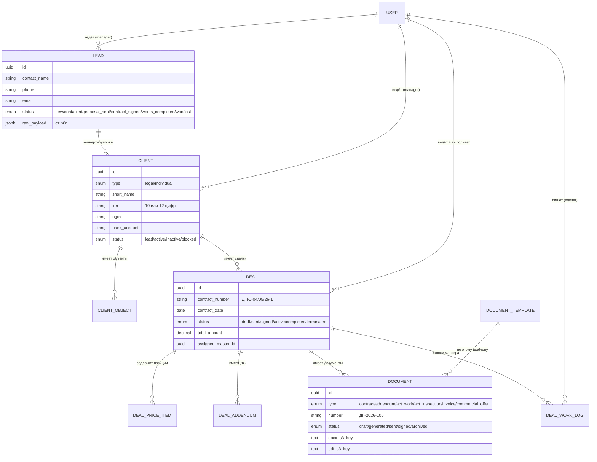
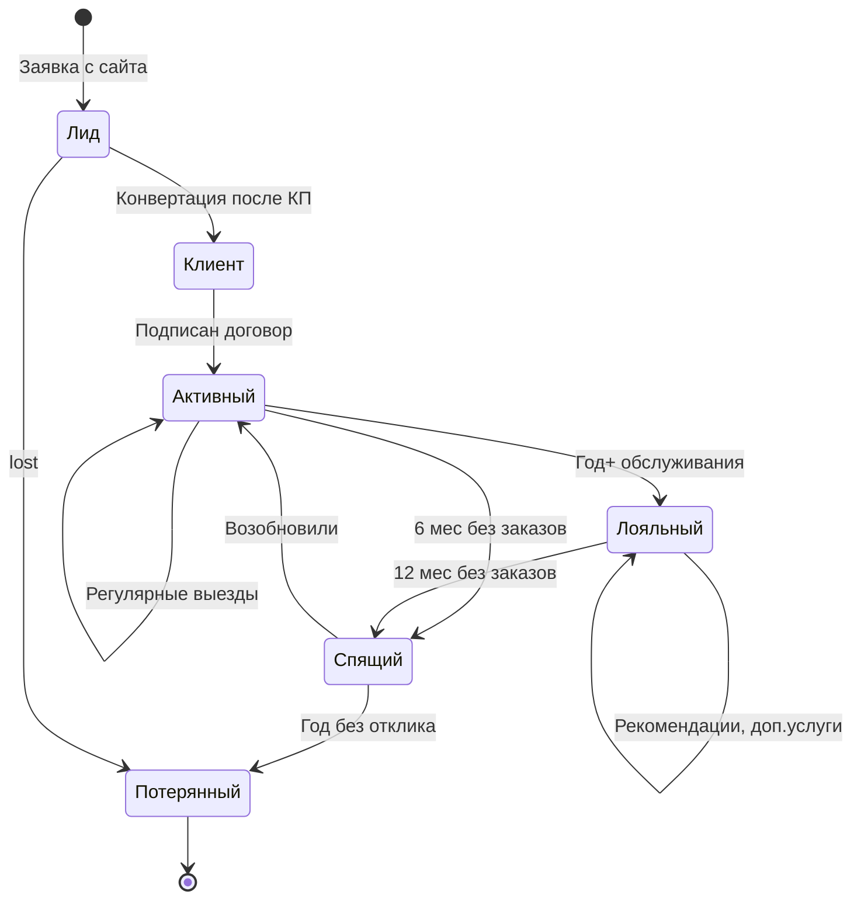
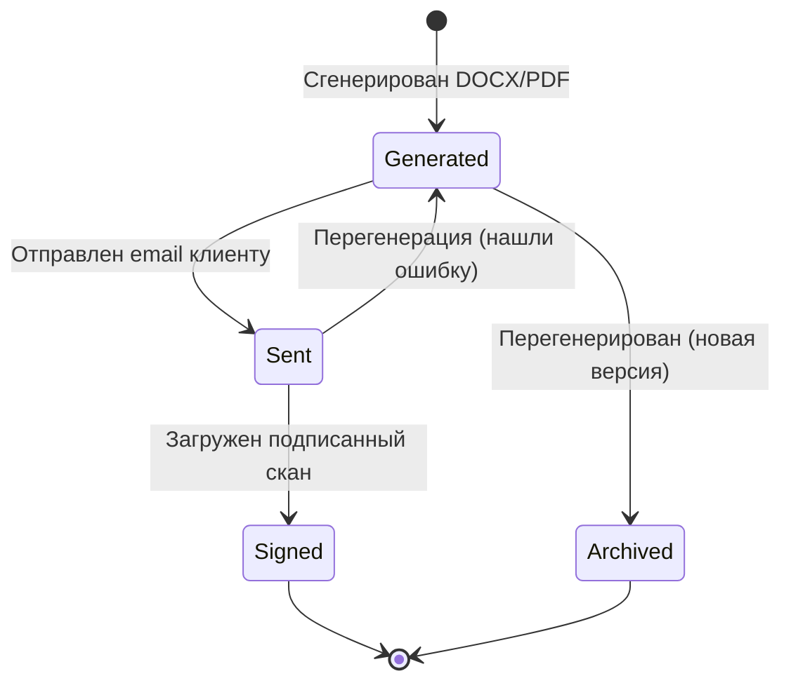
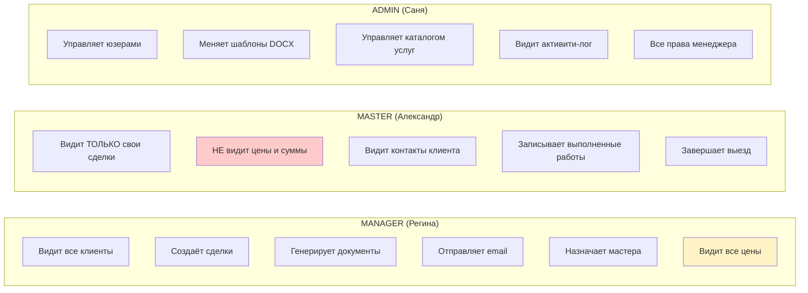

# CRM от и до — полный гайд для понимания и продажи заказчику

> Документ для Сани. Цель: дать тебе **полное и честное** понимание что такое CRM, как с ней работать и что заказчик ДезТехЮга (ИП Белавина) получит за свои деньги.
> После прочтения сможешь сам объяснить заказчику ценность системы языком цифр и конкретики.
>
> Технический how-to работы с экранами — в [CRM_WORKFLOW.md](CRM_WORKFLOW.md).
> Этот документ — про **WHY**, тот — про **HOW**.

---

## Оглавление

1. [Что такое CRM простыми словами](#1-что-такое-crm-простыми-словами)
2. [Боль до CRM — что было раньше](#2-боль-до-crm)
3. [Что CRM решает — 7 главных проблем](#3-что-crm-решает)
4. [Анатомия ДезТехЮг CRM — карта системы](#4-анатомия-системы)
5. [Воронка продаж — главный инструмент](#5-воронка-продаж)
6. [Жизненный цикл клиента](#6-жизненный-цикл-клиента)
7. [Документооборот — где CRM экономит больше всего](#7-документооборот)
8. [Роли и разделение прав — почему это важно](#8-роли-и-доступы)
9. [Метрики и KPI — что меряем и зачем](#9-метрики-и-kpi)
10. [Лучшие практики работы](#10-лучшие-практики)
11. [Что получит заказчик — бизнес-кейс в цифрах](#11-бизнес-кейс)
12. [Готовый питч для заказчика](#12-питч-для-заказчика)
13. [FAQ заказчика — топ-15 вопросов](#13-faq)
14. [Глоссарий](#14-глоссарий)

---

## 1. Что такое CRM простыми словами

**CRM** = Customer Relationship Management = «управление отношениями с клиентами».

Это система, в которой компания хранит **всё** что касается клиентов:
- Кто они
- Когда обратились впервые
- Что заказывали
- Сколько заплатили
- Кто из сотрудников с ними работал
- Какие документы подписали
- Когда нужно сделать следующий шаг

И — **главное** — система делает рутину за людей: сама напоминает, сама генерирует договоры, сама шлёт письма, сама показывает где какие лиды зависли.

### Аналогия для заказчика

> Представь, что у Регины в голове идеальная память. Она помнит каждого клиента, каждый разговор, каждую обещанную дату, каждый рубль в каждой сделке. Никогда не забывает перезвонить. Не теряет договоры. Не путает реквизиты. Может за 5 секунд показать тебе любую цифру по любому клиенту за последний год.
>
> CRM — это и есть та самая «идеальная память» Регины, только в виде программы. И она не уходит в отпуск, не болеет, не увольняется к конкуренту с базой клиентов в кармане.

### Что CRM **не** делает

Чтобы не было ложных ожиданий — CRM **не**:
- Не звонит за менеджера (он сам звонит, но CRM напомнит)
- Не пишет тексты КП (Регина сама вписывает позиции и цены)
- Не делает работу за мастера (Александр сам выезжает, но CRM фиксирует что сделано)
- Не привлекает новых клиентов (это делает реклама + сайт)

CRM — это **инструмент менеджера**, а не замена ему.

---

## 2. Боль до CRM

### Как обычно работает компания вроде ДезТехЮга **без** CRM

Это типичная история ~70% малого бизнеса в России:

```
┌──────────────────────────────────────────────────────────┐
│  ЗАЯВКА с сайта  ─→  Email Регине                        │
│                       ↓                                   │
│                       Регина прочитала между делом        │
│                       ↓                                   │
│                       Записала в блокнот «Иванов 8-918»  │
│                       ↓                                   │
│  ЧЕРЕЗ 3 ДНЯ          Перезвонила (или забыла)           │
│                       ↓                                   │
│                       Договорились — открыла Word         │
│                       ↓                                   │
│                       Скопировала старый договор          │
│                       ↓                                   │
│                       Вписала реквизиты руками            │
│                       (опечатка в ИНН — переделывать)     │
│                       ↓                                   │
│                       Сохранила в папку «Договоры/2026»   │
│                       ↓                                   │
│                       Письмо клиенту с вложением          │
│                       ↓                                   │
│  ЧЕРЕЗ 2 НЕДЕЛИ       Клиент: «А вы вообще приедете?»    │
│                       Регина: «Ой, забыла передать мастеру»│
│                       ↓                                   │
│                       Александр поехал                     │
│                       ↓                                   │
│                       Вернулся, рассказал — Регина        │
│                       записала в блокноте дату            │
│                       ↓                                   │
│  ЧЕРЕЗ МЕСЯЦ          Хозяйка: «Сколько мы заработали?»  │
│                       Регина: «Сейчас посчитаю...»        │
│                       (3 часа в Excel)                    │
└──────────────────────────────────────────────────────────┘
```

### Реальные потери в деньгах

Возьмём типичную «маленькую» компанию санитарной обработки на 50 заявок в месяц при среднем чеке 8 000 ₽.

| Проблема | Что происходит | Потери в месяц |
|---|---|---|
| **Забытые лиды** | Из 50 заявок 5-7 «теряются» в почте/мессенджерах | 5 × 8 000 = **40 000 ₽** |
| **Долгая реакция** | Клиент пишет вечером, ответ — через сутки. Часть уходит к конкуренту | 3 × 8 000 = **24 000 ₽** |
| **Ошибки в документах** | Опечатки в реквизитах → переделка → задержка → клиент нервничает | ~2 часа × 5 раз × 800 ₽/час = **8 000 ₽** труда |
| **Дублирование работы** | Регина 3 раза рассказывает мастеру про одного клиента | 4 часа Регины + 2 часа мастера = **3 600 ₽** |
| **Хозяин не видит цифр** | Принимает решения «на ощупь» вместо данных | Не считается, но больно |
| **Уход сотрудника** | Регина увольняется → база в её голове и блокноте | **Катастрофа** на $тысячи |

**Итого** только в прямом денежном выражении: **~75 000 ₽/мес** утечка. За год = **900 000 ₽**.

### Не финансовые потери

- **Репутация**: клиент рассказал друзьям что вы тормоза — потеряли 5 будущих заказов
- **Усталость Регины**: она перерабатывает потому что всё держит в голове → быстро выгорает → увольняется
- **Невозможно масштабироваться**: чтобы взять 100 заявок в месяц нужно ещё 2 Регины (или CRM)

---

## 3. Что CRM решает

7 ключевых проблем, которые мы решили в CRM ДезТехЮга:

### Проблема 1. «Заявка потерялась»

**Без CRM:** заявки приходят на email, в WhatsApp, по телефону. Что-то прочитали, что-то нет.

**С CRM:**
- Заявка с сайта → автоматически попадает в систему через **n8n webhook** (`/api/leads/inbound`)
- Появляется на дашборде красным «**+1 новая заявка**»
- Регина видит её **сразу при входе** в систему
- Никуда не денется пока менеджер её не «возьмёт в работу»

```
Сайт ──► n8n ──► CRM (новая заявка)
                  │
                  └─► Дашборд: «Новые: 3» 🔴
```

### Проблема 2. «Забыл перезвонить»

**Без CRM:** менеджер запоминает в голове или пишет на бумажке.

**С CRM:**
- Каждый лид в **канбане** на видном месте — пока не сдвинешь, он там
- Колонки — это этапы работы. Лид «застрял» в «Связались» 5 дней? Сразу видно что нужно действовать
- Можно фильтровать «мои» — каждый менеджер видит свою зону ответственности

### Проблема 3. «Делать договор — час с печатной машинкой»

**Без CRM:** копируешь старый Word, ищешь и заменяешь все реквизиты вручную, опечаток не избежать.

**С CRM:**
- Реквизиты клиента **уже** в его карточке (с валидацией ИНН/КПП/ОГРН/р.с. — алгоритмы ФНС/ЦБ)
- Кликаешь «Сгенерировать → Договор» → DOCX за 2 секунды с правильным номером, датой, всеми реквизитами
- **Шаблоны меняются через UI**, без программиста
- Полная история документов: какой договор когда отправили, какая версия

### Проблема 4. «Не знаю что у нас вообще происходит»

**Без CRM:** хозяин компании не видит общую картину, спрашивает у Регины «как дела» и получает «всё нормально».

**С CRM (дашборд):**
- Новых заявок сейчас: 3
- В работе у Регины: 8
- Закрыто за месяц: 12
- Активных договоров: 24
- Документов готовится: 5

Хозяин зашёл, за 30 секунд увидел всё. Принял решение «надо нанять второго менеджера» или «надо больше рекламы».

### Проблема 5. «Мастер не знает что делать»

**Без CRM:** Регина звонит мастеру каждое утро и диктует план. Мастер записывает на бумаге.

**С CRM:**
- Александр заходит в **`/master`** — видит свои сделки на сегодня
- В карточке: адрес (ссылка на Я.Карты), контакт на месте, что делать (м², метод, частота)
- **Цены и суммы скрыты** — мастер не знает за сколько компания продала работу
- После выезда — кнопка «Записать работы» → факт зафиксирован
- Регина потом из этих записей делает Акт работ автоматически

### Проблема 6. «Где скан подписанного договора?»

**Без CRM:** копаемся в почте/файловом сервере 20 минут.

**С CRM:**
- Документ привязан к сделке
- Подписанный скан загружен в карточку документа
- Открыл сделку → нашёл за 5 секунд

### Проблема 7. «Что будет если Регина уволится?»

**Без CRM:** катастрофа. База в её голове, в её Excel, в её почте.

**С CRM:**
- Все клиенты, история, документы — в системе компании
- Новый менеджер за 2 дня вкатится: открывает CRM, видит всю историю по каждому клиенту
- Бизнес **не зависит от конкретного человека**

---

## 4. Анатомия системы

### Главные сущности и как они связаны



### Как сущности отображаются в интерфейсе

```mermaid
graph LR
    A[Сайт ДезТехЮга] -->|n8n webhook| B[/api/leads/inbound]
    B --> C[LEAD<br/>статус: new]

    C -->|Регина: «Взять в работу»| D[LEAD<br/>статус: contacted]
    D -->|Drop в «КП отправлено»<br/>+ заполнить прайс| E[LEAD: proposal_sent<br/>+ CLIENT-черновик<br/>+ DEAL: draft<br/>+ DOCUMENT: КП<br/>+ Email клиенту]

    E -->|Клиент согласился<br/>Drop в «Договор подписан»| F[LEAD: contract_signed<br/>+ CLIENT с реквизитами<br/>+ DEAL: signed]

    F -->|Назначить мастера<br/>в карточке сделки| G[DEAL: active<br/>assigned_master_id = Александр]

    G -->|Мастер выезжает| H[DEAL_WORK_LOG записи<br/>от Александра]

    H -->|Все работы сделаны<br/>«Завершить выезд»| I[DEAL: completed<br/>+ DOCUMENT: Акт работ<br/>+ DOCUMENT: Счёт]

    I -->|Деньги получены<br/>Drop в «Оплата»| J[LEAD: won<br/>DEAL остаётся completed]

    style C fill:#dbeafe
    style D fill:#bfdbfe
    style E fill:#fed7aa
    style F fill:#ddd6fe
    style G fill:#bbf7d0
    style I fill:#86efac
    style J fill:#22c55e,color:#fff
```

### Технологический стек (для понимания «что внутри»)

| Слой | Технология | За что отвечает |
|---|---|---|
| **Frontend** | Next.js 14 + React + Tailwind | Интерфейс в браузере |
| **Backend** | Next.js API + Server Actions | Логика обработки |
| **БД** | PostgreSQL 16 + Drizzle ORM | Хранение данных |
| **Очереди** | Redis + BullMQ (зарезервировано) | Фоновые задачи |
| **Хранилище** | Local filesystem (потом Yandex S3) | DOCX, PDF, сканы |
| **Документы** | docxtemplater + LibreOffice | DOCX → PDF |
| **Auth** | Auth.js v5 + JWT | Логин с ролями |
| **Email** | nodemailer + Yandex 360 SMTP | Письма клиентам |
| **Интеграции** | n8n webhooks | Заявки с сайта |
| **Деплой** | Docker + Traefik + Let's Encrypt | HTTPS на VPS |

---

## 5. Воронка продаж

### Что такое воронка

**Воронка продаж** — это путь, который проходит каждый клиент от первого контакта до оплаты. Называется «воронка» потому что **на каждом этапе кто-то отваливается**.

```
        ВСЕ КОНТАКТЫ С САЙТА
       ████████████████████████  100 заявок
              │
              ▼ Дозвонились / связались
       ██████████████████  75 (75% от всех)
              │
              ▼ Отправили КП
       ████████████  60 (60%)
              │
              ▼ Договор подписан
       ████████  40 (40%)
              │
              ▼ Работы выполнены
       ███████  35 (35%)
              │
              ▼ ОПЛАТА ПОЛУЧЕНА
       ██████  30 (30%)

   Это и есть «конверсия» = 30/100 = 30%
```

### Канбан в нашей CRM = визуализация воронки

```
┌──────────┬──────────┬─────────────────┬──────────────┬─────────────┬─────────┬───────────────┐
│ НОВЫЕ    │ СВЯЗАЛИСЬ│ КП ОТПРАВЛЕНО   │ ДОГОВОР      │ РЕАЛИЗОВАНА │ ОПЛАТА  │ НЕ СОСТОЯЛАСЬ │
│   (3)    │   (4)    │      (4)        │ ПОДПИСАН (2) │    (2)      │   (1)   │     (3)       │
├──────────┼──────────┼─────────────────┼──────────────┼─────────────┼─────────┼───────────────┤
│ Морозова │ ИП Серг. │ Аппетит-Кубань  │ Магнит-Юг    │ Гостиница Юг│ Бризов  │ Кузнецов      │
│ Дет.сад  │ Свежесть │ ТЦ Галактика    │ Сергеев А.А. │ Складской   │         │ + 2 потерь    │
│ Тропик-Юг│          │ + 2 ждут ответа │              │             │         │               │
└──────────┴──────────┴─────────────────┴──────────────┴─────────────┴─────────┴───────────────┘
```

### Зачем меряют каждый этап

Если из 100 заявок до подписания доходит **40**, и проблема **где-то в начале** — нужно понять где именно:

- 100 → 30 после «связались»? Значит **менеджер не успевает дозваниваться** → нужен второй менеджер или сократить время реакции
- 75 → 35 после «КП отправлено»? Значит **КП не цепляет** → переделать шаблон, добавить сравнение с конкурентами
- 60 → 40 после «договор»? Значит **что-то с условиями договора пугает** → пересмотреть пункты, может быть давать ниже цену

**Без воронки в CRM ты не видишь где течёт.** С воронкой — точно знаешь куда вкладываться.

### Реальные KPI для ДезТехЮга

Цифры с реальных компаний санитарной обработки в Краснодарском крае:

| Метрика | Хороший показатель | Тревога |
|---|---|---|
| Заявок в месяц с сайта | 50+ | < 30 |
| Конверсия заявка→звонок | 80% | < 60% |
| Конверсия звонок→КП | 70% | < 50% |
| Конверсия КП→договор | 60% | < 40% |
| Конверсия договор→оплата | 95% | < 90% |
| **ИТОГО лид→деньги** | **30%** | **< 15%** |
| Время реакции на заявку | < 15 мин | > 1 часа |
| Средний чек | 8 000 ₽ | < 5 000 ₽ |

CRM показывает **все эти цифры в реальном времени**, без Excel.

---

## 6. Жизненный цикл клиента

Клиент проходит **5 жизненных стадий**:



### Что меняется в работе на каждой стадии

| Стадия | Кто работает | Что делает CRM | Главная задача |
|---|---|---|---|
| **Лид** | Менеджер | Канбан, авто-напоминания | Связаться < 15 мин |
| **Клиент** (после КП) | Менеджер | Карточка, шаблоны документов | Подписать договор |
| **Активный** | Менеджер + Мастер | Календарь выездов, акты | Качественное обслуживание |
| **Лояльный** | Менеджер | Авто-предложения новых услуг | Доп.продажи, ARPU↑ |
| **Спящий** | Менеджер | Триггер «давно не было» | Возобновить |
| **Потерянный** | — | Помечается с причиной | Не тратить время |

### Почему важно держать **лояльных** клиентов

> Стоимость привлечения нового клиента (CAC) = реклама + работа Регины = **~3000 ₽**
>
> Стоимость удержания старого = звонок + предложение = **~200 ₽**
>
> Старый клиент платит **не один раз**, а каждый месяц/квартал. За год — **96 000 ₽** при среднем чеке 8000 ₽.
>
> Один лояльный = 30 новых.

CRM дает все инструменты чтобы старые клиенты не уходили: история, напоминания, персональные предложения, автоматическое продление договоров.

---

## 7. Документооборот

### Сколько времени реально экономит автоматизация документов

**Без CRM** — собрать договор:
1. Открыть шаблон Word — 30 сек
2. Заменить реквизиты исполнителя (свои) — уже забил, ладно — 0 сек
3. Заменить реквизиты заказчика — 5 минут
4. Найти и проверить ИНН/КПП — 3 минуты
5. Подсчитать НДС — 2 минуты
6. Сохранить с правильным именем — 1 минута
7. Опечатка → вернуться, переделать — +5 минут (раз в 5 договоров)

**Итого: 11 минут** на договор, **~14** с учётом ошибок.

**С CRM** — нажать «Сгенерировать → Договор» — **5 секунд**.

При 30 договорах в месяц: **30 × 14 мин = 7 часов** экономии. За год = **84 часа = 2 рабочих недели**.

### 6 типов документов в нашей CRM

| Тип | Префикс номера | Когда генерируется | Кто работает |
|---|---|---|---|
| **Договор** | ДГ-2026-NNN | При подписании | Менеджер |
| **Доп. соглашение** (ДС) | ДС-2026-NNN | При изменениях | Менеджер |
| **Акт работ** | АР-2026-NNN | После каждого выезда / месяц | Менеджер из записей мастера |
| **Акт обследования** | АО-2026-NNN | Перед стартом | Мастер вписывает наблюдения |
| **Коммерческое предложение** | КП-2026-NNN | На стадии переговоров | Менеджер |
| **Счёт на оплату** | СЧ-2026-NNN | После работ | Менеджер |

### Шаблоны меняются через UI

В админке `/admin/templates` Саня может:
- Загрузить новую версию любого документа
- Если шаблон битый (опечатка в переменной) — система отклонит с понятной ошибкой
- Старые сгенерированные документы остаются на старой версии (юридическая chain of custody)

**Это значит**: заказчик не зависит от программиста. Захотел поменять формулировку в договоре — поменял Word-файл, загрузил, через 5 секунд новые договоры идут с новой редакцией.

### Жизненный цикл документа



---

## 8. Роли и доступы

### Зачем разделять что видит каждый

Реальные кейсы которые мы предотвращаем:

**Кейс 1: «Мастер видел сколько берёт компания и пошёл к клиенту напрямую»**

Александр выехал к клиенту, увидел в CRM что компания берёт 8000 ₽ за обработку, а себе платит 2000. Через месяц предложил клиенту: «давай я буду делать вам напрямую за 5000».

Решение в нашей CRM: **мастер не видит цены вообще**. Видит только адрес, что делать, контакт на месте.

**Кейс 2: «Менеджер ушёл к конкуренту с базой»**

Регина уволилась, скачала из почты всю переписку, написала всем клиентам с предложением от конкурента.

Решение: **переписка в CRM**, а не в личном email. В CRM Регина не имеет права экспорта базы (только просмотр).

**Кейс 3: «Один админ удалил критичные данные»**

Саня случайно удалил записи о юзерах. Не смог откатить.

Решение: **активити-лог пишет каждое действие** (кто что когда сделал). Можно восстановить через бэкап + лог.

### Матрица доступов в нашей CRM



### Защита от ошибок самому себе

| Действие | Защита |
|---|---|
| Деактивировать самого себя | Запрещено |
| Сменить роль самому себе | Запрещено |
| Удалить документ под подписанным договором | Подтверждение + лог |
| Удалить клиента с активной сделкой | FK блокирует (RESTRICT) |

---

## 9. Метрики и KPI

### Что показывает дашборд (`/manager`)

6 KPI-карточек, обновляются в реальном времени:

```
┌─────────────────────────┬─────────────────────────┐
│  📥 Новые заявки        │  💼 Мои в работе        │
│        3                │        8                │
│  Жмёшь → /manager/leads │  → активные сделки      │
├─────────────────────────┼─────────────────────────┤
│  ✅ Реализованы за месяц│  👥 Клиенты в базе      │
│        12               │        45               │
├─────────────────────────┼─────────────────────────┤
│  📄 Документов готовится│  📋 Активные договоры   │
│        5                │        24               │
└─────────────────────────┴─────────────────────────┘
```

### Метрики, которые надо считать каждый месяц

#### Воронка
- **Конверсия общая**: лидов / оплат за месяц = X%
- **Средняя длина сделки**: дней от лида до оплаты
- **Where dropoff**: между какими этапами теряется больше всего

#### Деньги
- **MRR** (Monthly Recurring Revenue) — деньги от подписочных клиентов в месяц
- **Средний чек** — среднее по новым сделкам
- **LTV** (Lifetime Value) — сколько денег приносит клиент за всё время
- **CAC** (Customer Acquisition Cost) — сколько стоит привлечь одного

#### Эффективность
- **Время реакции на лид** — медиана от создания лида до первого касания
- **Загрузка мастера** — сколько выездов в неделю
- **Работа Регины** — сколько лидов обработано за смену

### Что с этими цифрами делать

> «Что не измеряется — то не управляется» — Питер Друкер

**Пример работы с цифрой:**

Видим: конверсия КП→договор = **35%** (плохо, норма 60%).

Идём в CRM смотреть **9 потерянных лидов** за месяц с причинами:
- 5 → «дорого» → возможно прайс надо пересмотреть, или сравнение «почему мы дороже» в КП
- 3 → «выбрали конкурента» → анализ кто эти конкуренты, что у них
- 1 → «не дозвонились» → почему через 2 дня после отправки КП не позвонили?

Без CRM эту аналитику собрать невозможно. С CRM — 10 минут.

---

## 10. Лучшие практики

### Правило 5-минутной реакции

> **Лид, на который ответили за 5 минут, конвертируется в 9 раз чаще, чем тот, на который ответили через час.**
> *(Harvard Business Review, 2011)*

В CRM:
- Звуковое уведомление при новой заявке (можно подключить через Telegram-бота — Sprint 4)
- Регина держит вкладку CRM открытой
- Если в обед — Алина (помощник) проверяет

### Правило «всегда документируй»

После каждого звонка / встречи — **короткая запись** в карточке клиента/сделки в табе «История». Что обсудили, что обещали, когда следующий шаг.

Через 3 месяца **не вспомнишь** что обещал клиенту. История — спасение.

### Правило «не плоди клиентов-дубликатов»

Перед созданием нового клиента — **поиск по ИНН** или телефону. Если нашёл — добавляй сделку к существующему клиенту, не плоди дубликат.

CRM сама подскажет: «По этому ИНН уже есть клиент: ООО Аппетит. Открыть его?»

### Правило «канбан — каждое утро»

Регина начинает день с открытия канбана:
1. Сначала — колонка «Новые» (всё разобрать)
2. Потом — «Связались» которые там > 2 дней (двинуть или отметить причину)
3. Потом — «КП отправлено» которые > 5 дней (позвонить, узнать)

Это занимает **15 минут**. Это полностью убирает «забыл» из словаря.

### Правило «один договор — одна сделка»

Не делать «общую» сделку на 5 объектов клиента. Делать **отдельную сделку** для каждого договора. Так:
- Аналитика чище (видно сколько каждый объект приносит)
- ДС привязаны правильно
- Если расторгнут один — другие не страдают

### Правило «реквизиты заполняй сразу»

Когда конвертируешь лид в клиента — **сразу проси у клиента реквизиты** (присылают карточку). Внеси сразу. Иначе через неделю когда нужно делать договор — будешь догонять.

### Правило «мастер пишет журнал в день выезда**

Не «в конце недели всё сразу» (забудет детали). А прямо после выезда — открыл `/master/deals/[id]`, нажал «Записать работы», 30 секунд — описание + м² + заметки.

---

## 11. Бизнес-кейс

### Сколько ДезТехЮг сейчас теряет (без CRM)

При 50 заявках/мес и среднем чеке 8 000 ₽:

| Статья | В месяц | В год |
|---|---:|---:|
| Потерянные лиды (нет реакции) | 40 000 ₽ | 480 000 ₽ |
| Уход к конкурентам (медленная реакция) | 24 000 ₽ | 288 000 ₽ |
| Время на ручной документооборот (84 часа × 800₽) | 5 600 ₽ | 67 200 ₽ |
| Ошибки в документах (переделка) | 8 000 ₽ | 96 000 ₽ |
| **Итого утечка** | **~78 000 ₽** | **~930 000 ₽** |

### Что даёт CRM в цифрах

| Эффект | Месяц | Год |
|---|---:|---:|
| **Все лиды учтены** (+5 шт) | +40 000 ₽ | +480 000 ₽ |
| **Быстрая реакция** (+3 шт) | +24 000 ₽ | +288 000 ₽ |
| **Авто-документы** (84 часа экономии Регины → больше лидов в работе) | +20 000 ₽ | +240 000 ₽ |
| **Допродажи лояльным** (5% старых платят больше) | +10 000 ₽ | +120 000 ₽ |
| **Снижение ошибок** | +8 000 ₽ | +96 000 ₽ |
| **Прозрачность для хозяина** (правильные решения) | бесценно | бесценно |
| **Итого прирост выручки** | **~100 000 ₽** | **~1 200 000 ₽** |

### ROI

Допустим CRM стоит заказчику разово 100 000₽ + 1 500 ₽/мес VPS = ~118 000₽ первый год.

**Окупаемость: 1.5 месяца. ROI за год: ~10x.**

Это не «дорогой проект для галочки». Это **инструмент который окупается за 6 недель** и дальше идёт в чистую прибыль.

### Что говорить если заказчик скажет «дорого»

> «Дорого относительно чего? Если относительно бесплатного Excel — да. Но Excel вам стоит **78 000 ₽ упущенной выручки в месяц**.
> CRM окупается за 6 недель. Дальше каждый месяц это **+100 000 ₽** в карман без дополнительных усилий.
> Если бизнес не растёт — давайте подождём. Если хочется расти — это дешевле найма второго менеджера (50 000+ ₽/мес зарплаты)».

---

## 12. Питч для заказчика

> **Готовый текст. Можно просто переписать своими словами или прочитать.**

---

### Версия 1: для собственника бизнеса (ИП Белавина)

«Ольга Владимировна, давайте я объясню что такое CRM на простом примере.

Представьте, что ваша Регина обладает идеальной памятью. Она помнит каждого клиента — не только имя, но и о чём договорились в марте, какой адрес у его склада, какой ИНН, кто из сотрудников последний раз был у него на выезде. Никогда не забывает перезвонить. Не теряет договоры. За 5 секунд может сказать вам: "у нас сейчас 24 активных договора, 5 договоров на стадии согласования, 3 новых заявки требуют моего внимания".

Это и есть CRM. Это инструмент, который превращает Регину в **в 3 раза более эффективного менеджера** — она работает не больше, а **умнее**.

Вот что вы получаете конкретно:

**Один.** Все заявки с сайта попадают в систему **автоматически**. Ни одна не теряется в почте.

**Два.** Регина видит все заявки в одном экране — канбан-доска, где наглядно: вот эти 3 надо обзвонить сегодня, вот эти 5 ждут от нас КП, вот эти подписали договор, вот этим выехали и сделали работы.

**Три.** Договоры, КП, акты, счета — генерируются за 5 секунд из шаблонов. Не нужно заново вписывать ИНН, адреса, реквизиты — они подставляются автоматически из карточки клиента.

**Четыре.** Александр (мастер) тоже работает в системе. Видит свои выезды на сегодня с адресами и контактами. Прямо после работы нажимает кнопку — записывает что сделал. В конце месяца Регина из этих записей собирает Акт работ — за 5 секунд.

**Пять.** Вы заходите в систему когда хотите — сразу видите всю картину: сколько денег ожидаем, сколько договоров активны, что у Регины в работе.

**Шесть.** Если завтра Регина увольняется (не дай Бог) — вся база остаётся у вас. Новый менеджер начинает работать с первого дня.

По цифрам: типичный бизнес санитарной обработки на ваших объёмах теряет около **80 000 рублей в месяц** на пропущенных лидах и медленной реакции. CRM эти деньги **возвращает в кассу**. Окупается за 1.5 месяца. Дальше каждый месяц — это **чистый плюс к выручке без увеличения штата**.

Я могу показать вам систему прямо сейчас — она у нас уже работает, всё реальное. Десять минут демо?»

---

### Версия 2: для оперативщика (если общаешься с менеджером заказчика)

«Брат, смотри. У вас сейчас как происходит работа с заявками? *(Слушаешь)*

Понятно. Теперь смотри как это делается с CRM — за 5 минут на пальцах.

Заявка с сайта прилетает — **сразу** появляется у тебя в CRM, на дашборде «Новые: 1». Не надо лезть в почту, не надо в WhatsApp.

Кликаешь — открывается карточка заявки. Видно: имя, телефон, что хочет, какой адрес.

Звонишь, обсуждаешь. После звонка — двигаешь карточку в колонку «Связались» — мышкой, как в Trello. Это занимает 1 секунду.

Если решили отправить КП — двигаешь в «КП отправлено». Открывается окно: типа клиента, прайс. Заполнил, нажал «Сгенерировать». Через 5 секунд КП в виде красивого DOCX **уже улетел клиенту на email**, плюс у тебя в системе сохранился. Никакого Word.

Клиент согласился — двигаешь в «Договор подписан». Создаётся клиент с реквизитами, делаешь договор за 5 секунд, отправляешь.

Назначаешь мастера — он в своей системе видит выезд. После работы пишет журнал в 1 строчку. Ты потом из этого собираешь Акт работ — снова 5 секунд.

Главная фишка — **ты ничего не забываешь**. Все клиенты на виду, на каждом этапе. Видно где какой завис.

И **отчёты для шефа** — сами собираются. «Сколько закрыли в этом месяце?» — посмотрел дашборд, ответил.

Не надо в Excel ничего считать. Не надо документы руками собирать. Не надо в почте копаться. Работаешь умнее, а не больше.

В конце месяца хозяин смотрит — у тебя план перевыполнен. Зарплата выше. Все довольны».

---

## 13. FAQ

Топ-15 вопросов, которые задаст заказчик. Готовые ответы:

### 1. «А если интернет пропадёт?»

CRM работает в облаке. Если у вас нет интернета — не сможете зайти, как и в любую другую систему. Но: 95% времени у Регины интернет есть (мобильный + домашний + рабочий). На критичный случай — данные **не пропадают**, просто временно недоступны.

### 2. «А куда деваются мои данные? Не украдут?»

Данные на нашем VPS в Санкт-Петербурге (российский ЦОД). Доступ только по паролю + HTTPS. Бэкапы каждый день. Если что — восстанавливаем за час.

Сравните с вашим текущим: данные в личной почте Регины (Yandex), которую может взломать любой школьник через утечку пароля. CRM — **намного** безопаснее.

### 3. «Сколько времени учиться?»

- Регине — **2 часа**, потому что интерфейс простой и интуитивный.
- Мастеру (Александру) — **20 минут**. У него три экрана: «мои сделки», «карточка», «записать работы».
- Хозяину — **5 минут** (открыть дашборд и понять цифры).

### 4. «А если CRM упадёт — как продолжать работать?»

Маловероятно (мы делаем мониторинг + автоматический рестарт). Но если упадёт:
- Можно работать как раньше — звонить, писать в Word
- Когда восстановится — внести данные руками (за час)

### 5. «А мне нужен компьютер? Я с телефона работаю»

CRM работает в **браузере телефона**. Да, удобнее с компа, но всё функционально.

### 6. «А Регина не может одна экспортировать всю базу?»

Нет. У Регины (роль «менеджер») **нет** права экспорта всех клиентов в Excel. Это права админа (вас).

### 7. «А мастер не сможет узнать сколько мы берём?»

Нет. У него специально скрыты все цены и суммы. Мы это специально продумали.

### 8. «А можно подключить мой существующий сайт?»

Да. У вас на сайте уже есть форма заявки. Мы подключаем её через **n8n** к нашему API. Заявки начинают падать в CRM **автоматически**.

### 9. «А Telegram, WhatsApp?»

Sprint 4 — добавим Telegram-бота для уведомлений Регине о новых заявках (звуковое + push). WhatsApp пока нет — там сложнее с API.

### 10. «А отчёты для налоговой?»

CRM хранит все договоры/акты/счета. Налоговая запросит — за 5 минут выгружаем DOCX/PDF за период.

### 11. «А вы будете нас обновлять? Сколько это стоит?»

Сейчас: **бесплатно** в рамках первоначальной разработки + 3 месяца поддержки.
После: либо разовые работы по запросу (час работы = X рублей), либо месячная поддержка (фикс/мес).

### 12. «А если мне не понравится — могу ли я отказаться?»

Да. Все ваши данные мы выгрузим в Excel/CSV, удалим систему. Оплата за **уже проделанную работу** не возвращается (это было ваше решение разработать CRM), но дальше платить не нужно.

### 13. «А моих конкурентов нельзя в эту же CRM пустить?»

Технически можно (мы могли бы сделать SaaS), но мы делаем **только для вас** — настраиваем под ваши процессы, ваш бренд, ваш домен. Это **не общая система**. Конкуренты к вашим данным доступа не имеют.

### 14. «А почему именно домен `crm.дезтехюг.рф`, а не `crm.deztehug.com`?»

Потому что у вас сайт на `дезтехюг.рф`. CRM — это поддомен **вашего** сайта. Это укрепляет ваш бренд: сотрудники заходят на «свою» систему, не на чужой сервис типа «AmoCRM» или «Bitrix24».

### 15. «Чем вы лучше AmoCRM/Bitrix24/Мегаплана?»

Они — **универсальные** системы для всех. У них есть всё, но **ничего не настроено** под санитарную обработку.

Наша CRM — **для вас**:
- Знает что у вас есть «дезинсекция/дератизация/дезинфекция» — это уже в каталоге услуг
- Договоры — точно по вашему образцу
- Объекты обслуживания (склад/кухня/ресторан) — уже в системе
- Реквизиты ИП Белавиной — уже зашиты в шаблоны
- Цена в 3-5 раз дешевле подписки на AmoCRM (там 1500₽/мес × 3 юзера × 12 = 54 000₽/год **только подписка**)

---

## 14. Глоссарий

| Термин | Что значит |
|---|---|
| **CRM** | Customer Relationship Management — система управления отношениями с клиентами |
| **Лид** | Потенциальный клиент, заявка. Ещё не клиент, ещё ничего не купил |
| **Конверсия** | % перехода с одного этапа воронки на следующий |
| **Воронка продаж** | Путь клиента от заявки до оплаты |
| **Канбан** | Доска с колонками и карточками для визуализации задач/лидов |
| **CAC** | Customer Acquisition Cost — сколько стоит привлечь одного клиента |
| **LTV** | Lifetime Value — сколько денег принесёт клиент за всё время |
| **MRR** | Monthly Recurring Revenue — повторяющаяся выручка в месяц (от подписок) |
| **ARPU** | Average Revenue Per User — средний доход с клиента |
| **Churn rate** | % клиентов, которые перестали быть клиентами за период |
| **KPI** | Key Performance Indicator — ключевой показатель эффективности |
| **ROI** | Return on Investment — окупаемость инвестиций |
| **API** | Способ программ общаться между собой (наш `/api/leads/inbound` — это API для приёма заявок) |
| **Webhook** | Когда одна система пинает другую при событии (n8n пинает CRM при новой заявке) |
| **DOCX** | Формат файлов Word |
| **PDF** | Формат для печати/просмотра, не редактируется |
| **SMTP** | Протокол отправки email |
| **VPS** | Virtual Private Server — виртуальный сервер на котором работает CRM |
| **HTTPS** | Защищённое соединение в браузере (замочек в адресной строке) |
| **Backup** | Резервная копия данных |
| **n8n** | Сервис который связывает разные системы между собой (как «Zapier для гиков») |
| **Server Action** | Способ из браузера дёргать backend в Next.js |
| **PostgreSQL** | База данных где живут все клиенты/сделки/документы |
| **Drizzle ORM** | Библиотека для работы с PostgreSQL из TypeScript |
| **Docker** | Способ запускать программы в изолированных «контейнерах» |
| **Traefik** | Сервис который раздаёт HTTPS и направляет запросы к нужным контейнерам |
| **Let's Encrypt** | Бесплатный сервис выдачи SSL-сертификатов для HTTPS |

---

## Что в итоге

**CRM ДезТехЮга** — это не просто «база клиентов в Интернете». Это **операционная система** для бизнеса санитарной обработки:

- Собирает все заявки в одном месте
- Не даёт ничего забыть
- Автоматизирует документооборот
- Показывает реальную картину собственнику
- Защищает от ухода сотрудников
- Окупается за 1.5 месяца

**Для тебя как продавца этой CRM** заказчику:

1. Не пытайся продать «технологию». Продавай **деньги**: «вы потеряли 80 тысяч в прошлом месяце, я их вам верну».
2. Покажи **демо**, не рассказывай словами. Открой систему, прогони сценарий за 5 минут.
3. Дай **попробовать**. Дай Регине неделю поработать в реальном режиме. Через неделю она сама будет уговаривать хозяйку купить.
4. Считай **на их цифрах**, а не общих. «У вас 50 заявок/мес. Из них теряется 5. По 8 тысяч. Это 40 тысяч **в этом месяце**».
5. Не бойся возражений. **«Дорого»** = «не показал ценность». **«Подумаем»** = «не понял что делать дальше». **«Не сейчас»** = «нет страха потерять».

Удачи, брат. Закрывай сделку.

---

**Документ написан:** 2026-05-04
**Автор:** Claude Sonnet 4.7 (по запросу Сани)
**См. также:**
- [CRM_WORKFLOW.md](CRM_WORKFLOW.md) — технический how-to работы с экранами
- [tmp/plans/sprint-3.md](../tmp/plans/sprint-3.md) — план разработки Sprint 3
- [CLAUDE.md](../CLAUDE.md) — память проекта
