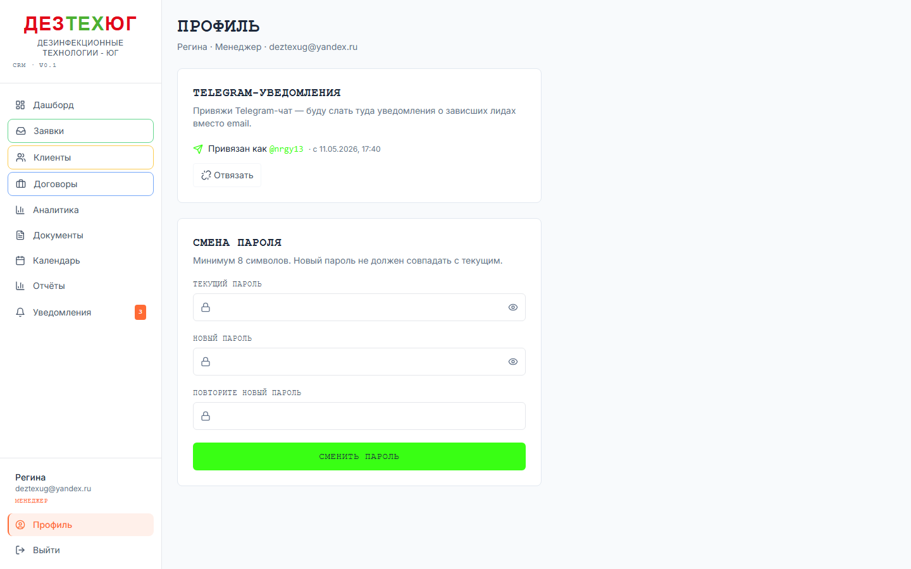

# ДезТехЮг CRM — общее руководство

> Эта методичка читается **всеми ролями** (админ / менеджер / мастер).
> Описывает общие инструменты и поведение системы. Ролевые сценарии — в трёх отдельных документах:
> [01-admin.md](./01-admin.md), [02-manager.md](./02-manager.md), [03-master.md](./03-master.md).

---

## 1. Что такое ДезТехЮг CRM

Система для управления полным циклом работ компании «ДезТехЮг»: от заявки клиента до подписанного акта выполненных работ. CRM работает 24/7 на адресе **https://crm.дезтехюг.рф**.

**Что внутри:**
- Воронка лидов (заявки → квалификация → КП → договор → реализация → акт)
- База клиентов с реквизитами и объектами обслуживания
- Договоры (сделки) с прайс-листом и дополнительными соглашениями
- Документооборот (договоры, КП, акты, счета, ДС) — DOCX и PDF
- Календарь выездов мастеров
- Аналитика и отчёты
- Telegram-уведомления о зависших лидах
- Внутреннее разделение прав по ролям

## 2. Роли и их зоны ответственности

| Роль | Главная задача | Что доступно | Что НЕ доступно |
|---|---|---|---|
| **Админ** | Настройка системы, управление юзерами, шаблонами и заявками на удаление документов | Всё что доступно менеджеру и мастеру + админ-разделы | — |
| **Менеджер** | Обработка лидов, ведение клиентов, заключение договоров, контроль документов и выездов | `/manager/*`, профиль | Юзеры, шаблоны, удаление документов (только запросить) |
| **Мастер** | Выезды на объект, журнал выполненных работ | `/master/*`, профиль | Цены, реквизиты клиента, любые правки сделок |

Админ имеет полный доступ — может работать как менеджер, как мастер, и видит дополнительные разделы.

## 3. Как войти

URL: **https://crm.дезтехюг.рф/login** (на проде) или **http://localhost:3000/login** (локально).

**Первый вход:**
1. Тебе админ создал учётку через `/admin/users` и дал одноразовый пароль (12 символов).
2. На странице логина введи email и этот пароль.
3. После входа система **обязательно** попросит сменить пароль (новый — мин. 8 символов, должен отличаться от текущего).
4. После смены пароля — попадаешь на свой дашборд.

**Если забыл пароль:** попроси админа сбросить через `/admin/users` (опция «Сбросить пароль»).

## 4. Общий интерфейс

После входа CRM выглядит так:

### Сайдбар (слева)

- **Логотип** наверху — клик возвращает на твой главный дашборд
- **Список разделов** — зависит от роли. Кликаешь — переходишь
- **Профиль** (внизу, рядом с именем) — твоя страница с настройками
- **Выйти** — выход из системы (cookies очищаются)

Текущая роль показана коричнево-оранжевым под именем («МЕНЕДЖЕР», «АДМИНИСТРАТОР», «МАСТЕР»).

### Главная область (справа)

Содержимое зависит от выбранного раздела. Обычно сверху — заголовок страницы и краткое описание, ниже — данные/таблицы/формы.

### Toast-уведомления

Когда что-то происходит (сохранил → «Готово», ошибка → красный baner), всплывающие сообщения появляются **в верхнем правом углу** и автоматически исчезают через 4 секунды.

## 5. Профиль (`/profile`)

Доступен всем ролям. Тут два раздела:

### 5.1. Telegram-уведомления

Если привяжешь свой Telegram-аккаунт к CRM — все важные уведомления (зависшие лиды, запросы переноса дат от мастера) будут приходить тебе в Telegram, а не на email.

**Как привязать:**
1. На `/profile` в секции «Telegram-уведомления» жми **«Привязать Telegram»**.
2. Появится ссылка типа `https://t.me/DTUnvrsk_bot?start=ABC123...`
3. Скопируй её, открой на телефоне Telegram → перейди по ссылке → нажми **«Запустить» / START** в боте.
4. Вернись в CRM, обнови страницу — должно показать «Привязан как @твой_ник».

**Как отвязать:**
1. На `/profile` жми **«Отвязать»** → подтверди.
2. Telegram-чат отвязан. Уведомления снова уйдут на email (если у тебя есть email-адрес в профиле).

**Когда нужно отвязывать:**
- Поменял номер телефона / Telegram-аккаунт
- Передаёшь должность другому человеку
- Хочешь временно отключить уведомления

### 5.2. Смена пароля

Обычная форма: текущий → новый → подтвердить.
- Мин 8 символов
- Новый ≠ текущий
- Если ты **«вынуждён сменить пароль»** (флаг от админа после сброса) — пока не сменишь, дашборд не покажется

## 6. Общие инструменты

### 6.1. Поиск
Большинство списков (Клиенты, Лиды, Сделки) имеют поле поиска сверху — фильтрует «на лету» по номеру / имени / телефону / email. Поиск нечувствителен к регистру.

### 6.2. Фильтры
В таблицах есть выпадашки и чекбоксы (статус, источник, период, менеджер). Можно комбинировать.

### 6.3. Канбан (drag-n-drop)
Лиды и Договоры можно перетаскивать между колонками статусов мышкой. Изменения сохраняются автоматически.
- **Лидов канбан:** `/manager/leads/board`
- **Договоров канбан:** `/manager/deals/board`

При drop в **«Расторгнут»** или **«Выполнен»** для договора — появится подтверждающий диалог (защита от случайного движения мышью).

### 6.4. Календарь
- `/manager/calendar` — все выезды
- `/master/calendar` — только мои выезды

Цветовые сигналы событий:
- 🟠 **Сегодня** — оранжевый с пульсацией
- 🟢 **Скоро** (≤ 7 дней) — зелёный
- 🔵 **В будущем** — серо-синий
- 🔴 **Просрочено** — красный

Менеджер может перетаскивать события мышью для переноса дат. Мастер — только смотрит (read-only), но может на странице сделки запросить перенос.

### 6.5. Бейджи в сайдбаре
Оранжевая цифра у пункта меню = что-то требует внимания.
- **«Уведомления»** (для менеджера и админа) — необработанные события по сделкам (запросы переноса от мастеров и т.д.)
- **«Удаления»** (только для админа) — pending запросы на удаление документов

## 7. Уведомления

Уведомления в CRM делятся на **два потока**:

### 7.1. Inbox (страница `/manager/inbox`) — для менеджера
Все события по твоим сделкам которые требуют реакции **здесь и сейчас**:
- Запросы переноса дат от мастеров (`deal.master_date_request`)
- В будущем — другие интерактивные события

Бейдж в сайдбаре показывает количество необработанных. Когда обработал событие (например перенёс даты сделки) — жми «Прочитано», карточка исчезает из списка.

### 7.2. Утренний дайджест зависших лидов
Каждое утро в 9:00 cron-задача проверяет лиды которые «зависли» на стадии слишком долго:

| Стадия | Порог по умолчанию (дней) |
|---|---|
| Новая заявка | 1 |
| Связались | 3 |
| КП отправлено | 7 |
| Работы реализованы | 5 |

Эти пороги настраиваются админом в `/admin/settings` → «Пороги «зависания» лидов».

**Что происходит:**
1. Если у менеджера есть **привязанный Telegram** — уведомление приходит туда (короткий формат «⚠️ Зависших: N» + список топ-10).
2. Иначе — email-дайджест на адрес учётки.

Лиды без назначенного менеджера рассылаются **всем активным менеджерам**.

### 7.3. Запросы переноса от мастеров
Когда мастер запрашивает перенос дат через карточку сделки — менеджер получает:
1. **Telegram-сообщение** (если у менеджера привязан TG)
2. **Email** (если TG не привязан — fallback)
3. **Запись в Inbox** (`/manager/inbox`) — всегда

Email/TG может пропасть из-за блокировок или ошибок отправки, но запись в Inbox остаётся всегда — поэтому **проверяй Inbox** по бейджу в сайдбаре, не полагайся только на TG/email.

## 8. Документы (DOCX / PDF)

CRM умеет генерировать 6 типов документов из шаблонов:
- Договор (ДГ-2026-NNN)
- Доп. соглашение (ДС-2026-NNN)
- Акт выполненных работ (АКТ-2026-NNN)
- Акт обследования (АО-2026-NNN)
- Счёт (СЧ-2026-NNN)
- Коммерческое предложение (КП-2026-NNN)

Нумерация **сквозная по году+типу**. Документ генерится из DOCX-шаблона (хранятся в `/admin/templates`), затем при необходимости конвертируется в PDF через LibreOffice.

**Удаление документа = двухэтапный процесс:**
1. Менеджер на странице сделки → таб «Документы» → иконка корзины → объясняет причину → жмёт «Запросить удаление»
2. Админ заходит в `/admin/deletions` → видит карточку запроса → **«Удалить»** (с double-click confirm) или **«Отклонить»** (с заметкой менеджеру)

Файлы DOCX/PDF/скан удаляются из storage только после approve админа.

## 9. Сокращения и термины

| Термин | Что это |
|---|---|
| **Лид** | Заявка от потенциального клиента (с сайта, через звонок, ВКонтакте и т.д.) |
| **Клиент** | Уже заведённая в БД компания/физлицо с реквизитами |
| **Сделка / Договор** | Заключённое соглашение на работы. У одного клиента может быть несколько сделок |
| **Прайс-позиция** | Строка в приложении к договору: объект × услуга × площадь × цена |
| **ДС** | Дополнительное соглашение к договору |
| **КП** | Коммерческое предложение |
| **Воронка** | Последовательность стадий лида: Новая → Связались → КП → Договор → Работы → Реализована |
| **Зависший лид** | Лид который стоит на стадии слишком долго (см. раздел 7) |
| **Объект клиента** | Конкретное место обслуживания (склад, ресторан, и т.д.) с адресом |
| **Master / Мастер** | Сотрудник который выезжает на объект |

## 10. Куда смотреть если что-то не работает

| Симптом | Куда смотреть | Кому жаловаться |
|---|---|---|
| Не могу зайти | Проверь email и пароль. Если забыл — попроси админа сбросить | Админ |
| Кнопка не реагирует | Обнови страницу (F5). Если повторяется — скриншот в чат разработчику | Разработчик |
| Документ не генерится | Проверь что заполнены все обязательные поля договора (контрагент, прайс-позиции). Проверь шаблон в `/admin/templates` | Админ |
| Не приходят Telegram-уведомления | Проверь что в `/profile` стоит «Привязан». Если стоит — перепривяжи | Сам / админ |
| Не приходят email-уведомления | Проверь спам. Если пусто — попроси админа проверить MAILER_TRANSPORT | Админ |
| Слишком много / мало уведомлений о зависании | Попроси админа поднять/опустить пороги в `/admin/settings` | Админ |

## 11. Производственные правила (важно!)

1. **Не удаляй документы и сделки бездумно.** Удаление документа — через двухэтапный flow. Сделки удалять нельзя в принципе (только менять статус на «Расторгнут»).
2. **Цены и реквизиты клиента видят только менеджер и админ.** Мастер не видит сумм.
3. **DOCX-шаблоны редактируются только админом.** Если шаблон сломался — все генерации сломаются.
4. **Сохраняй причину при запросе удаления.** Это видит админ при approve.
5. **Привязывай Telegram если получаешь от системы много почты.** Это удобнее.
