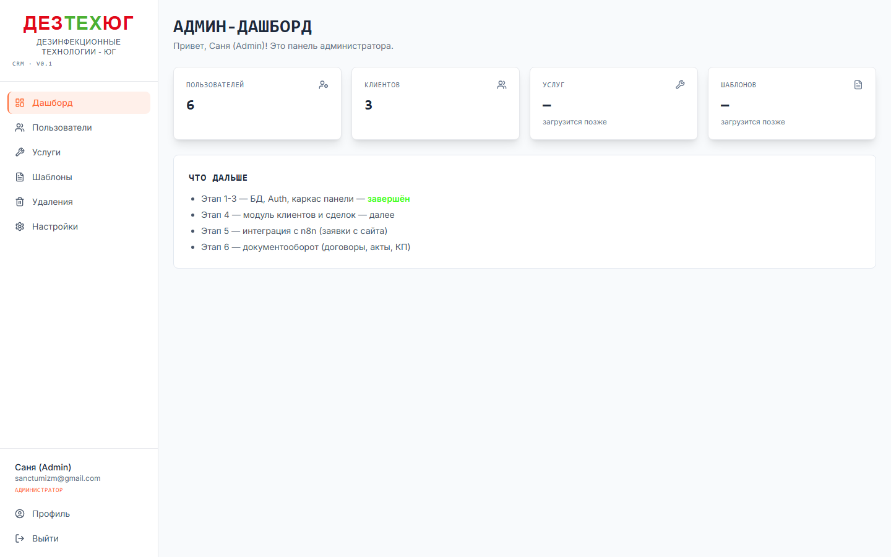
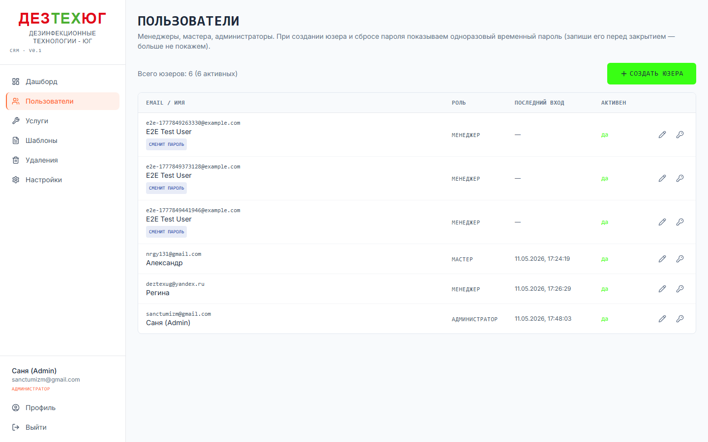
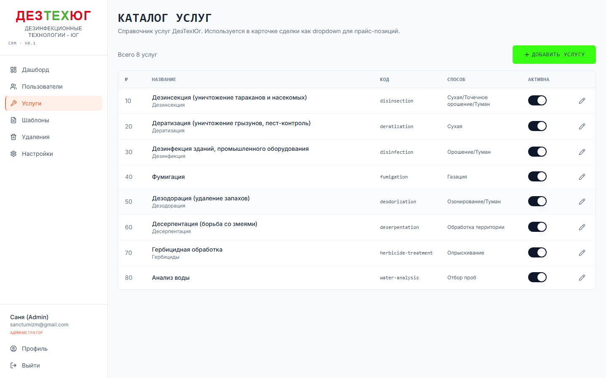
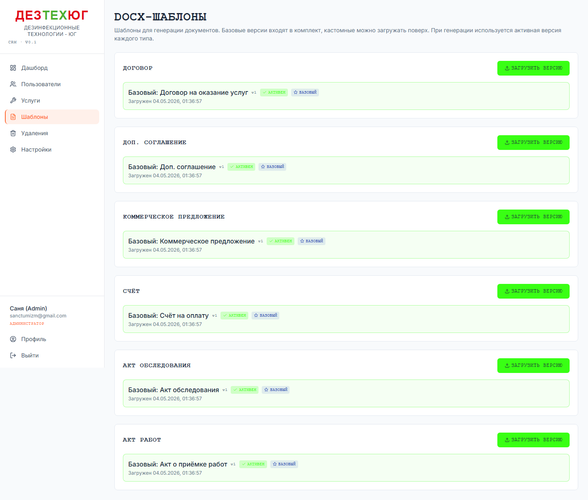
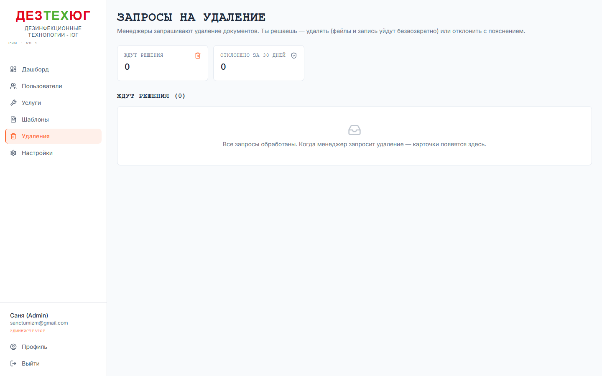
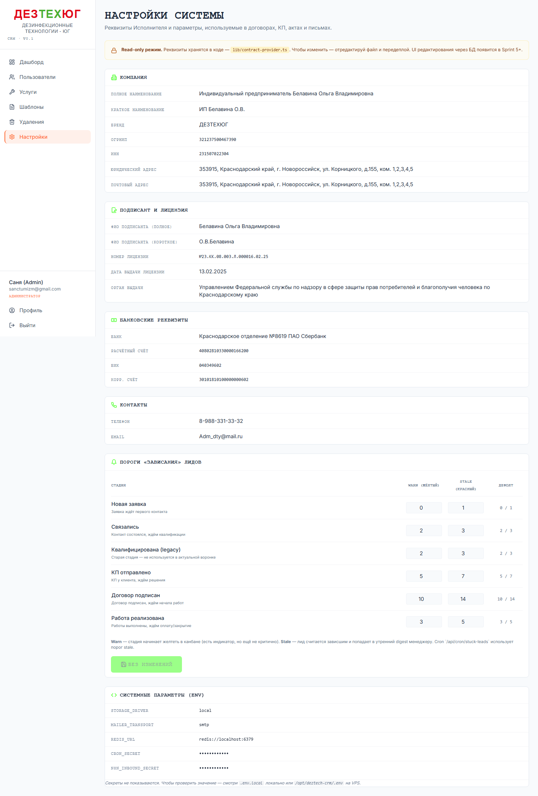

# Админ — методичка

> Эта методичка — для роли **Администратор** (`role=admin` в БД).
> Перед чтением — ознакомься с общей [00-general.md](./00-general.md).

Админ — это **Саня** (sanctumizm@gmail.com). У админа полный доступ ко всем разделам менеджера, мастера, плюс пять админ-только разделов.

## Содержание

1. [Админ-дашборд](#1-админ-дашборд)
2. [Пользователи](#2-пользователи-adminusers)
3. [Услуги](#3-услуги-adminservices)
4. [Шаблоны документов](#4-шаблоны-документов-admintemplates)
5. [Удаления (approval queue)](#5-удаления-admindeletions)
6. [Настройки системы](#6-настройки-системы-adminsettings)
7. [Сценарии](#7-сценарии)

---

## 1. Админ-дашборд

URL: **`/admin`**



**Что показано:**
- Сводные счётчики: пользователей, клиентов, услуг, шаблонов
- Краткая инфо «что доступно» (исторический текст по Sprint'ам — после прода Sprint 6 можно убрать)

**Когда сюда заходить:** это просто landing для админа. По делу — переходи в нужный раздел через сайдбар.

## 2. Пользователи (`/admin/users`)



Управление учётками сотрудников. Видишь email, ФИО, телефон, роль, активность, последний вход.

### 2.1. Создать нового юзера

1. Кнопка **«Создать»** наверху → форма
2. Заполни:
   - Email (уникальный — по нему юзер логинится)
   - ФИО (отображается в CRM)
   - Телефон (опц.)
   - Роль: `admin` / `manager` / `master`
3. Жми «Создать»
4. **Система сгенерит одноразовый пароль (12 случайных символов)** и **покажет его ТУТ ЖЕ в UI** с кнопкой «Скопировать».
5. **СКОПИРУЙ И ПЕРЕДАЙ ЮЗЕРУ** — пароль больше нигде не сохраняется. Если потерял — придётся делать сброс.
6. У нового юзера флаг `passwordMustChange = true` — при первом входе он обязан сменить.

### 2.2. Сбросить пароль

1. В строке юзера → кнопка «Сбросить пароль»
2. Confirm → система генерит новый одноразовый пароль и показывает его в UI
3. Передай юзеру

### 2.3. Деактивировать юзера

В строке юзера → переключатель «Активен» → off.
- Деактивированный юзер не сможет войти
- Его сделки и лиды остаются, но новые задачи на него не назначаются
- Можно реактивировать в любой момент

**Защита:** ты не можешь деактивировать **сам себя** и не можешь поменять **свою роль**. Если хочешь — попроси другого админа.

### 2.4. Сменить роль

Дропдаун «Роль» в строке юзера. Меняй с подтверждением.

**Внимание:** если поменять роль с `manager` на `master` — все сделки, назначенные на этого менеджера, нужно переназначить вручную (CRM этого не делает автоматически).

## 3. Услуги (`/admin/services`)



Каталог услуг компании. Эти услуги попадают в выпадашки при формировании прайс-листа сделки.

### Стандартные услуги (seeded на проде)

| Slug | Название | Сокращение |
|---|---|---|
| `disinsection` | Дезинсекция | Дезинсекция |
| `deratization` | Дератизация | Дератизация |
| `disinfection` | Дезинфекция | Дезинфекция |
| `fumigation` | Фумигация | Фумигация |
| `deodorization` | Дезодорация | Дезодорация |
| `deserpentation` | Десерпентация (от змей) | Десерпентация |
| `herbicide-treatment` | Гербицидная обработка | Гербициды |
| `water-analysis` | Анализ воды | Анализ воды |

### 3.1. Создать услугу

Кнопка «Создать» → форма:
- Slug (уникальный, без пробелов)
- Полное название
- Краткое название (для дропдаунов)
- Описание (опц.)
- Sort order — порядок отображения в дропдаунах
- Активна (toggle)

### 3.2. Редактировать / Деактивировать

Inline-toggle активности — кликаешь на switch, сразу сохраняется. Для других полей — кнопка «Редактировать».

**Деактивированная услуга**:
- Не появляется в дропдаунах при создании прайс-позиции
- В уже существующих позициях остаётся (исторические данные сохраняются)

## 4. Шаблоны документов (`/admin/templates`)



DOCX-шаблоны для генерации документов (договор, КП, акт работ, акт обследования, счёт, ДС, прочее).

### 4.1. Как устроен шаблон

DOCX-файл с переменными в фигурных скобках:
```
{client.shortName}
{deal.contractNumber}
{deal.contractDate}
{priceItems[*].objectName}
{provider.fullName}
```

При генерации CRM подставляет реальные значения из БД. Переменные документированы внутри шаблонов (открой `templates/*.docx` для примеров).

### 4.2. Загрузить новый шаблон

1. Кнопка «Загрузить» → выбери `.docx` файл (или drag-n-drop)
2. CRM **проверит синтаксис через docxtemplater** — если переменные сломаны, покажет ошибку и НЕ загрузит
3. Заполни:
   - Тип документа (contract / commercial_offer / act_work / etc)
   - Название (для UI, например «Договор v3 (с НДС)»)
   - Описание (опц.)
4. Жми «Сохранить» — шаблон загружается в storage, версия инкрементируется
5. Активность auto-on. Шаблон сразу подключается ко всем новым генерациям.

### 4.3. Версионирование

- Каждый шаблон имеет `version` — увеличивается при перезагрузке файла
- При генерации документа записывается **какая версия шаблона использовалась**
- Это видно в карточке документа (поле «Версия шаблона»)

**Зачем:** если шаблон сломался — можно понять, какие документы сгенерены на сломанной версии.

### 4.4. Деактивировать шаблон

Toggle в строке. Деактивированный шаблон:
- Не используется при новых генерациях
- В fallback: если активного шаблона нет, CRM использует файл из `templates/*.docx` (закоммичен в репо)

## 5. Удаления (`/admin/deletions`)



Очередь запросов на удаление документов. Меня менеджеры запрашивают — ты одобряешь или отклоняешь.

### 5.1. Очередь pending

Карточки наверху — запросы что ждут твоего решения. Каждая показывает:
- Тип документа + номер
- Связанные сделка/клиент (clickable, открыть в новой вкладке)
- Кто и когда запросил
- **Причина** (текст менеджера)

### 5.2. Одобрить удаление

1. Жми **«Удалить»** на карточке
2. Кнопка становится **«Точно удалить?»** (4 секунды на подтверждение)
3. Жми **ещё раз** в этом окне
4. Файлы DOCX/PDF/скан **физически удаляются** из storage, запись из БД сносится, карточка пропадает
5. Toast «{Документ} удалён»

**ВАЖНО:** действие необратимо. Если случайно одобрил — документ не вернуть, нужно перегенерировать через сделку.

### 5.3. Отклонить удаление

1. Жми **«Отклонить»** → modal
2. Напиши **причину** для менеджера (мин 1 символ)
   - Пример: «Документ нужен для отчёта в налоговую», «Переведи в архив через смену статуса вместо удаления»
3. Жми «Отклонить запрос»
4. Карточка перемещается в раздел **«Отклонено за 30 дней»** (видна 30 дней после решения)
5. Менеджер на странице сделки увидит inline-badge «Удаление отклонено: {твоя заметка}»

### 5.4. Бейдж в сайдбаре

Цифра у пункта **«Удаления»** в твоём сайдбаре — это количество **pending** запросов. Заходишь в раздел — список появится автоматически. После approve/reject цифра обновится после перезагрузки страницы.

## 6. Настройки системы (`/admin/settings`)



### 6.1. Компания + Подписант + Банк + Контакты + Лицензия — read-only

Реквизиты ИП Белавиной (Исполнитель) — то, что подставляется в шаблоны документов. Эти данные **захардкожены в коде** в файле `lib/contract-provider.ts`. UI редактирования через БД — на будущее.

**Если нужно поменять реквизиты (новая лицензия, смена банка и т.п.):**
1. Скажи разработчику — отредактирует `lib/contract-provider.ts`
2. Передеплой
3. **Старые сгенерированные документы не меняются** (они сохранены как есть в storage)

### 6.2. Пороги «зависания» лидов

Управление настройками для cron-задачи `runStuckLeadsCheck`.

**Что это:** для каждой стадии воронки указано:
- **Warn** (дней) — лид начинает «желтеть» в канбане (визуальный сигнал, но в digest пока не включается)
- **Stale** (дней) — лид попадает в утренний digest менеджеру

**Как работает:**
1. Меняй значения в инпутах — кнопка «Сохранить» становится активной
2. Жми «Сохранить» → значения уходят в БД (таблица `app_settings`, key=`notification_thresholds`)
3. На следующий cron-проход (9:00 каждый день) значения подхватываются

**Дефолтные значения** (когда нет переопределения в БД):

| Стадия | Warn | Stale |
|---|---|---|
| Новая заявка | 0 | 1 |
| Связались | 2 | 3 |
| Квалифицирована (legacy) | 2 | 3 |
| КП отправлено | 5 | 7 |
| Договор подписан | 10 | 14 |
| Работы реализованы | 3 | 5 |

**Если что-то сломал** — жми «Сбросить к дефолту». Запись из `app_settings` удаляется, система возвращается к коду.

**Валидация:** warn ≥ 0, stale ≥ 1, warn ≤ stale. Иначе сохранить не даст.

### 6.3. Системные параметры (env)

Read-only список ключевых ENV-переменных: storage driver, mailer transport, redis url, cron secret, n8n inbound secret. **Секреты не показываются** в открытом виде (только наличие).

Чтобы поменять — отредактируй `.env.local` (dev) или `/opt/deztech-crm/.env` (prod), потом перезапусти сервер.

## 7. Сценарии

### Сценарий 1: Создать менеджера

1. `/admin/users` → «Создать»
2. Email = `marina@deztech.example`, ФИО = «Марина Иванова», Роль = `manager`
3. Скопировать сгенерированный пароль (`Wk7nF4mPg3qZ`)
4. Передать Марине лично или в защищённом канале (не в открытом чате!)
5. Скажи: «При первом входе обязательно смени пароль»

### Сценарий 2: Загрузить новый шаблон договора

1. Получи от юриста обновлённый DOCX (например `dogovor-2026-v3.docx`)
2. Открой `/admin/templates`
3. Жми «Загрузить» → выбери файл
4. Тип = `contract`, название = «Договор v3 (с НДС 5%)»
5. Сохрани. CRM проверит синтаксис.
6. Старый шаблон автоматически переходит в неактивный (если задано «активный по типу»). Если хочешь оставить оба — после загрузки toggle активность.
7. **Smoke-проверь:** сгенерируй один тестовый договор из любой сделки → открой DOCX → убедись что выглядит правильно.

### Сценарий 3: Одобрить запрос на удаление

1. Утром заходишь в CRM, видишь бейдж «Удаления 3» в сайдбаре
2. `/admin/deletions` → читаешь причины менеджера
3. По каждому решаешь:
   - «Создал документ на не того клиента» → одобряем (двойной клик «Удалить»)
   - «Заменил на новый счёт» → лучше отклоняем (можно перевести старый в архив, не удалять)
4. Для отклонённых — пишешь заметку менеджеру через modal

### Сценарий 4: Поднять порог зависания для «КП отправлено»

Менеджеры жалуются что каждое утро приходит дайджест про КП которые отправлены 7 дней назад — а в B2B норма ждать 2 недели.

1. `/admin/settings` → секция «Пороги «зависания» лидов»
2. Найди строку «КП отправлено» → в колонке «Stale» поменяй 7 на 14
3. «Warn» можно тоже поднять с 5 на 10 (чтобы желтение начиналось ближе к stale)
4. Жми «Сохранить» → toast «Пороги сохранены»
5. Следующий cron в 9:00 — лиды на стадии КП с возрастом 7-13 дней больше не зависают.

### Сценарий 5: Сменить роль уволенного мастера на менеджера

Не делать! Лучше деактивировать его учётку и завести новую с правильной ролью. Иначе придётся переназначать его сделки/лиды вручную.

Правильно:
1. `/admin/users` → у уволенного master → переключи «Активен» в off
2. Создай нового юзера с правильной ролью

### Сценарий 6: Восстановить случайно удалённый документ

**Нельзя.** Удаление через approve flow необратимо: файлы из storage уже стёрты, запись из БД тоже.

Что можно сделать:
- **Сгенерировать заново** из сделки (если шаблон жив, прайс-позиции на месте) — получится новый документ с новым номером
- Если совсем горит — восстановление из бэкапа БД (но это работа разработчика на VPS)

**Это причина почему есть approve flow:** двухступенчатое решение защищает от случайностей. Думай дважды перед двойным кликом «Удалить».
