# Менеджер — методичка

> Эта методичка — для роли **Менеджер** (`role=manager`).
> Перед чтением — ознакомься с общей [00-general.md](./00-general.md).

Менеджер — это **Регина** (deztexug@yandex.ru). Главная задача: обрабатывать заявки и проводить их по воронке от лида до акта.

## Содержание

1. [Дашборд](#1-дашборд-manager)
2. [Заявки (Лиды)](#2-заявки-лиды-managerleads)
3. [Канбан воронки](#3-канбан-воронки-managerleadsboard)
4. [Клиенты](#4-клиенты-managerclients)
5. [Договоры (Сделки)](#5-договоры-сделки-managerdeals)
6. [Канбан сделок](#6-канбан-сделок-managerdealsboard)
7. [Календарь выездов](#7-календарь-выездов-managercalendar)
8. [Аналитика](#8-аналитика-manageranalytics)
9. [Документы (общий список)](#9-документы-managerdocuments)
10. [Отчёты](#10-отчёты-managerreports)
11. [Уведомления (Inbox)](#11-уведомления-managerinbox)
12. [Сценарии](#12-сценарии)

---

## 1. Дашборд (`/manager`)

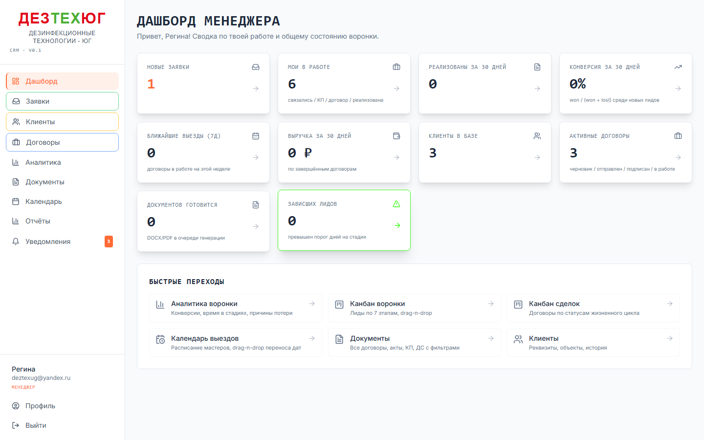

**10 виджетов:**

| Виджет | Что показывает | Куда ведёт |
|---|---|---|
| Новые заявки | Лиды в статусе `new` | `/manager/leads?status=new` |
| Мои в работе | Лиды на которых ты назначен и они в активных стадиях | `/manager/leads?mine=1` |
| Реализованы за 30 дней | Лиды win'нутые за последние 30 дней | `/manager/leads?status=won` |
| Конверсия за 30 дней | `won / (won + lost) * 100` для лидов созданных за 30 дней | `/manager/analytics` |
| Ближайшие выезды (7д) | Сделки с датой выезда в окне `[сегодня, +7 дней]` и статус `sent/signed/active` | `/manager/calendar` |
| Выручка за 30 дней | Сумма `total_amount` по сделкам с `status=completed` за 30 дней | `/manager/analytics` |
| Клиенты в базе | Всего клиентов | `/manager/clients` |
| Активные договоры | Сделки в статусе `draft/sent/signed/active` | `/manager/deals` |
| Документов готовится | Документы в статусе `draft` (ещё не сгенерированы) | `/manager/documents` |
| Зависших лидов | Лиды превысили порог дней на стадии (см. админ настройки) | `/manager/leads/board` |

**Цвета виджетов:**
- 🟠 оранжевый = что-то требует внимания (новые лиды, зависшие)
- 🟢 зелёный = хороший результат (выручка > 0, конверсия > 30%)
- ⚪ серый = нейтральное состояние или 0

**Секция «Быстрые переходы»** внизу — 6 ярлыков на главные разделы (Аналитика, Канбан, Календарь, Документы, Клиенты).

## 2. Заявки (Лиды) (`/manager/leads`)

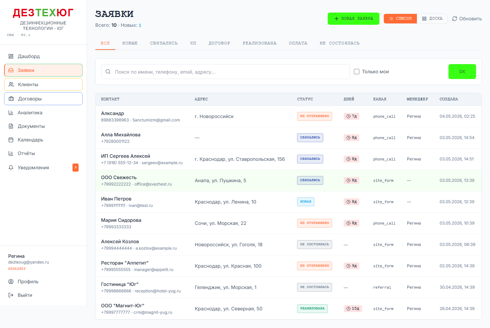

Табличный вид всех лидов. Колонки: ФИО / телефон / email / источник / статус / назначенный менеджер / создан / дни на стадии.

### 2.1. Откуда лиды попадают в систему

| Источник | Как попадают |
|---|---|
| **Сайт ДезТехЮг** | Заявка с формы → n8n → POST `/api/leads/inbound` (с защитным заголовком) |
| **Ручное создание** | Менеджер жмёт «Создать заявку» (например клиент позвонил) |
| **Конвертация контакта** | Из карточки клиента можно «Создать лид» |

### 2.2. Стадии лида (воронка)

| Slug | Название | Цвет | Что значит |
|---|---|---|---|
| `new` | Новая | зелёный | Только что прилетела, никто не контактировал |
| `contacted` | Связались | синий | Звонили/писали, есть обратная связь |
| `qualified` | Квалифицирована | (legacy) | Старая стадия, не используется в новой воронке |
| `proposal_sent` | КП отправлено | сиреневый | Коммерческое предложение у клиента |
| `contract_signed` | Договор подписан | оранжевый | Договор подписан, ждём начала работ |
| `works_completed` | Работы реализованы | оранжевый | Мастер выполнил, ждём подписи акта |
| `won` | Реализована | зелёный (final) | Сделка закрыта успешно |
| `lost` | Не состоялась | серый (final) | Лид потерян (с причиной) |

### 2.3. Фильтры

- **Статус** — выбрать одну стадию
- **Источник** — site / phone / vk / referral / manual / other
- **Только мои** — лиды где ты назначенный менеджер
- **Поиск** — по тексту (ФИО, телефон, email)

### 2.4. Карточка лида

Клик по строке → откроется детальная страница:
- Контакты клиента (звонок / email прямо из карточки)
- История стадий (когда и кто менял)
- Кнопка **«Конвертировать в клиента»** (создаёт `clients` запись + draft-сделку)
- Кнопка **«Пометить как Lost»** с обязательной причиной (выпадашка из 9 типовых: высокая цена, конкурент, не дозвонились, потребность отпала, отложено, решили сами, не наш регион, спам, другое)
- Поля: тип услуги, ориентировочная площадь, объект, заметки

## 3. Канбан воронки (`/manager/leads/board`)

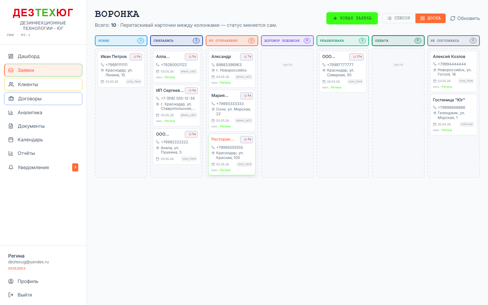

Та же воронка, но в виде доски с колонками. **Drag-n-drop** между статусами:

### 3.1. Перенос лида

- Зажми карточку → перетащи в другую колонку → отпусти
- CRM сохраняет автоматически (toast «Лид → стадия X»)
- В историю добавляется запись

### 3.2. Drop в «КП отправлено» — особый flow

Если перетаскиваешь в колонку «КП отправлено» и **у лида ещё нет привязанного клиента**, открывается **`ProposalDialog`**:

1. Тип клиента: ИП / Юр.лицо / Физ.лицо
2. Название (для ИП = «ИП Иванов И.И.»)
3. Email клиента (для отправки КП)
4. Прайс-позиции (объект × услуга × площадь × цена)
5. Срок действия КП

Когда жмёшь «Создать»:
- Атомарно создаётся клиент-черновик (без полных реквизитов)
- Создаётся сделка в статусе `draft`
- Сохраняются прайс-позиции
- Генерится DOCX «Коммерческое предложение»
- Отправляется email клиенту с приложенным DOCX

Если жмёшь «Отмена» — статус лида откатывается обратно.

### 3.3. Drop в «Не состоялась»

Открывается dialog с **обязательной причиной потери** (выпадашка). Без причины не сохранит.

### 3.4. Цвета карточек

- 🟢 зелёная рамка — свежий лид
- 🟡 жёлтая — превышен warn-порог
- 🔴 красная — превышен stale-порог (зависший)

## 4. Клиенты (`/manager/clients`)

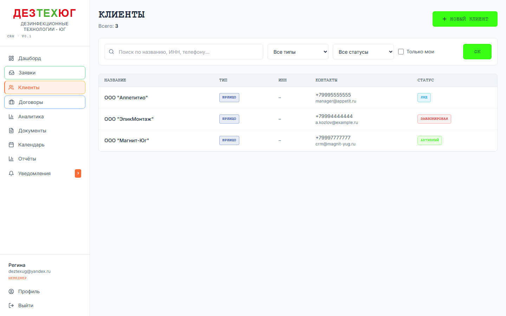

База контрагентов с реквизитами и объектами обслуживания.

### 4.1. Поля клиента

- Краткое и полное название
- Тип: `ip` / `ooo` / `physical`
- ИНН (с валидацией на 10/12 цифр и контрольную сумму)
- ОГРН/ОГРНИП (с валидацией)
- КПП (для ООО)
- Юридический и почтовый адреса
- Email и телефон
- Источник (где взяли клиента)
- Заметки

### 4.2. Создать клиента

- Из общего списка → «Создать»
- Из карточки лида → «Конвертировать в клиента» (часть полей подтянется автоматически)

### 4.3. Карточка клиента

Несколько секций:
- **Реквизиты** (с inline-edit)
- **Объекты обслуживания** — конкретные адреса где работаем (склад, ресторан, и т.д.). У каждого объекта: название, адрес, площадь, контактное лицо на месте, телефон контакта
- **Договоры** — список всех сделок с этим клиентом
- **История** — лог изменений

### 4.4. Создать сделку из карточки клиента

Кнопка «Создать сделку» → форма с предзаполненным `clientId` → попадаешь на страницу новой сделки в режиме редактирования.

## 5. Договоры (Сделки) (`/manager/deals`)

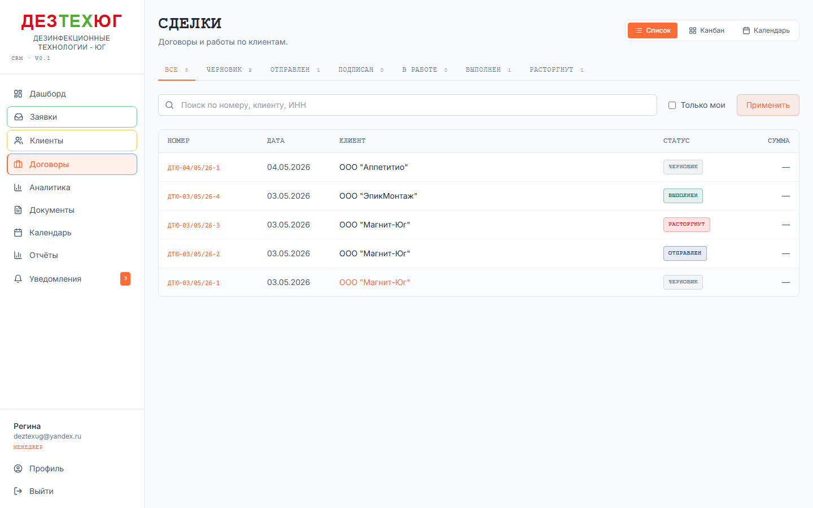

Список всех сделок: номер договора, дата, клиент, статус, период работ, мастер, менеджер, сумма.

### 5.1. Статусы сделки

| Slug | Название | Когда переходить |
|---|---|---|
| `draft` | Черновик | Только что создана |
| `sent` | Отправлен | Отправлен клиенту по email |
| `signed` | Подписан | Загружен скан подписи |
| `active` | В работе | Идут выезды мастера |
| `completed` | Выполнен | Все работы сданы, акт подписан |
| `terminated` | Расторгнут | Сделка прекращена досрочно |

### 5.2. Карточка сделки (5 табов)

#### Реквизиты
- Номер договора (auto: `ДТЮ-DD/MM/YY-N`, на момент генерации первого DOCX переименуется в официальный `ДГ-2026-NNN`)
- Дата договора + место
- Клиент (read-only, link)
- Период работ: дата начала, дата окончания, **опц. время начала/окончания** (если указать — событие в календаре станет timed, иначе all-day)
- Назначенный менеджер
- Назначенный мастер
- Подписанты (Исполнитель = ИП Белавина по умолчанию; Клиент — что в карточке клиента)
- Заметки

#### Прайс
Таблица позиций: объект × услуга × площадь × способ × периодичность × цена без НДС × НДС % × итого с НДС.

- Кнопка «Добавить» — новая позиция
- Inline-edit полей
- Удаление через корзину
- Внизу строка ИТОГО: сумма без НДС / сумма с НДС

#### Документы
Список сгенерированных документов с действиями:
- **DOCX** / **PDF** — скачать
- **«Отправить»** (✈️) — открывает диалог с email клиента, выбор формата DOCX/PDF, тема, тело письма
- **«Перегенерировать»** (🔄) — заново сгенерировать с актуальными данными (старая версия в storage перезапишется)
- **«Запросить удаление»** (🗑) — открывает modal где пишешь причину; запрос уходит в `/admin/deletions` к админу

При **pending** запросе на удаление — в строке появляется badge «Запрошено удаление · {ты} · {дата}», под ним причина. Кнопка «Перегенерировать» прячется. Появляется кнопка «Отменить» (отменить твой запрос пока админ не решил).

При **rejected** — badge «Удаление отклонено: {заметка админа}». Можно запросить ещё раз с другой причиной.

Кнопка **«Сгенерировать»** наверху — выпадашка с типами документов:
- Договор (`contract`)
- Коммерческое предложение (`commercial_offer`)
- Акт обследования (`act_inspection`)
- Акт выполненных работ (`act_work`)
- Счёт (`invoice`)

ДС генерится из таба «ДС» (см. ниже).

#### ДС (Дополнительные соглашения)
Список ДС к этому договору. Каждое ДС имеет внутренний номер (1, 2, 3...) и при генерации DOCX получает официальный номер `ДС-2026-NNN` (сквозной по году).

Создать новое ДС: «Создать ДС» → форма (описание изменений + структурированные правки в `bodyJson`). Затем «Сгенерировать DOCX» — попадает в общий таб «Документы».

#### История
Activity log по сделке: создания, смены статуса, добавление прайс-позиций, генерация документов, запросы удаления, запросы переноса от мастера.

Запись `deal.master_date_request` — когда мастер просит перенести даты выезда. В changes_json есть `from`/`to` даты + причина.

## 6. Канбан сделок (`/manager/deals/board`)

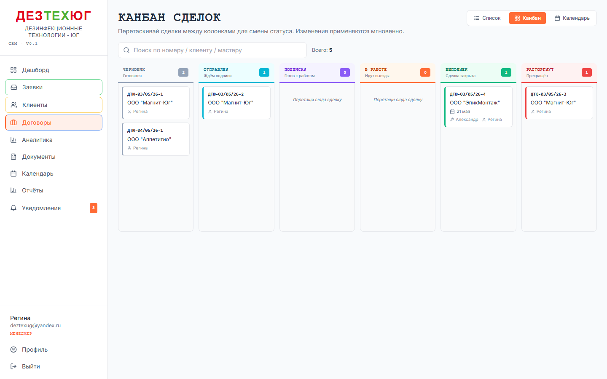

Колонки = статусы сделки. Drag-n-drop работает так же как в канбане лидов.

**Особенность:** при drop в **«Расторгнут»** или **«Выполнен»** появляется **AlertDialog подтверждения**:
- Информация о сделке (номер, клиент)
- Описание что произойдёт
- Кнопки «Отмена» / «Расторгнуть» (или «Закрыть»)

Это защита от случайного срабатывания мыши — расторгнутые/закрытые сделки откатить можно только сменой статуса вручную (новой записью в истории).

## 7. Календарь выездов (`/manager/calendar`)

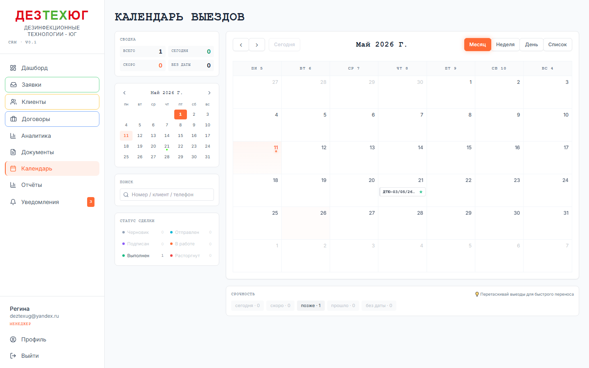

FullCalendar с событиями = сделки в статусах `signed/active/completed`.

### 7.1. Виды

- **Месяц** (Month) — обзор
- **Неделя** (Week) — детально по часам (06:00 — 22:00)
- **День** (Day) — focus на 1 день
- **Список** (List) — табличный вид

### 7.2. Цвета событий (health)

- 🟠 оранжевый с пульсацией — **сегодня**
- 🟢 зелёный — **скоро** (≤ 7 дней)
- ⚪ серо-синий — **в будущем** (> 7 дней)
- 🔴 красный — **просрочено** (дата прошла)
- 🟡 жёлтый — **без даты**

Левая полоска события — цвет статуса сделки.

### 7.3. Drag-n-drop переноса

Зажми событие → перетащи в новый день / слот → отпусти. CRM сохраняет автоматически (toast «Сделка → DD.MM»). Запись попадает в activity_log как `deal.dates_drag`.

**Ограничение:** во время save следующий drag блокируется. Если попробуешь — toast «Подожди — сохраняю предыдущий перенос».

### 7.4. Tooltip на hover

Наведение мышью на событие — справа появляется tooltip с:
- Номером договора
- Клиентом
- Телефоном клиента (clickable `tel:`)
- Периодом работ
- Мастером и менеджером
- Health-индикатором

### 7.5. Фильтры (sidebar справа)

- **Поиск** по номеру/клиенту/телефону
- **По статусу** (можно несколько)
- **По срочности** (today / soon / future / past / no-date)

### 7.6. Сделки без дат

Внизу под календарём — карточки сделок без `start_date/end_date`. Клик — открывается сделка.

## 8. Аналитика (`/manager/analytics`)

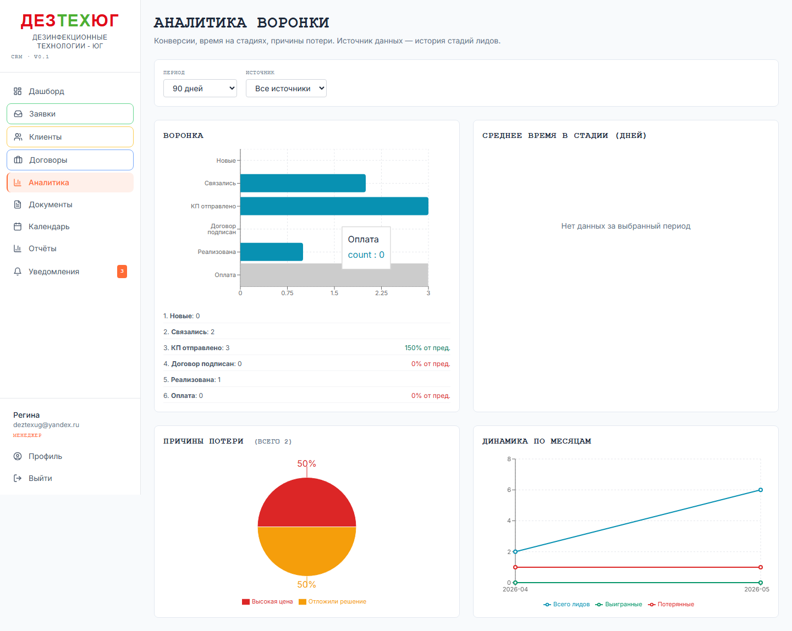

4 виджета recharts по воронке лидов:

1. **Воронка** — bar chart с конверсиями между стадиями (`new → contacted → ... → won`)
2. **Среднее время в стадии** — сколько дней лиды стоят в каждой стадии
3. **Причины потери** — pie chart по `lost_reason_code`
4. **Динамика по месяцам** — line chart total/won/lost помесячно

### Фильтры

- Период: 30 / 90 дней / весь
- Менеджер (только у admin — ты видишь только своих)
- Источник

## 9. Документы (`/manager/documents`)

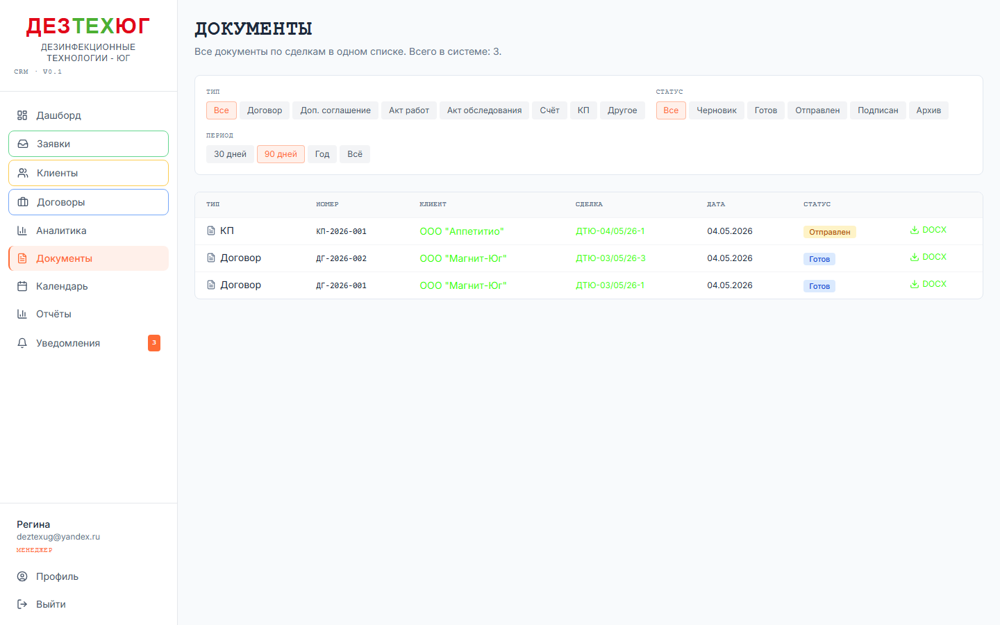

Один большой список ВСЕХ документов в системе. Колонки: тип / номер / клиент / сделка / дата / статус / действия.

**Фильтры:** тип документа, статус, период.

**Зачем сюда заходить:** когда нужно найти документ а сделку не помнишь. Например «А где КП-2026-013?» — нашёл по номеру → клик → открыл сделку.

Действия в этой странице ограничены — только просмотр и скачивание. Запросы на удаление делаются из таба «Документы» внутри сделки.

## 10. Отчёты (`/manager/reports`)

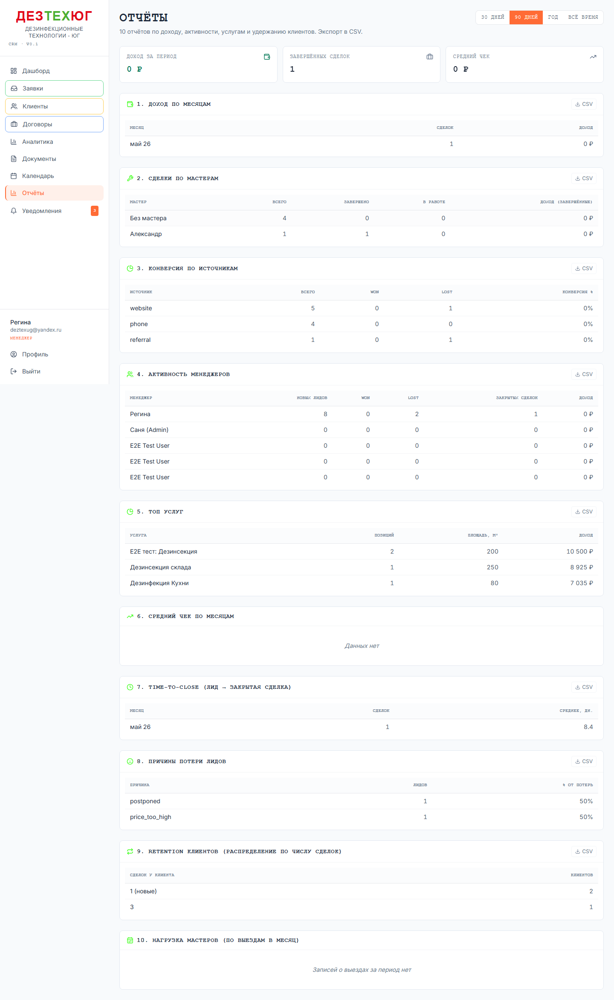

10 отчётов по доходу, активности, услугам, удержанию.

### 10.1. Period switcher

Сверху справа — переключатель **30 / 90 / 365 дней / Всё время**. Меняет период для всех 10 отчётов разом.

### 10.2. KPI-чипы (3 вверху)

- Доход за период (₽)
- Завершённых сделок
- Средний чек (рассчитывается как доход / сделок)

### 10.3. Список отчётов

| № | Отчёт | Что показывает |
|---|---|---|
| 1 | Доход по месяцам | За каждый месяц: сделок + доход |
| 2 | Сделки по мастерам | По каждому мастеру: всего/завершено/в работе/доход |
| 3 | Конверсия по источникам | Source → total/won/lost/конверсия% |
| 4 | Активность менеджеров | По каждому: новых лидов/won/lost/закрытых сделок/доход |
| 5 | Топ услуг | Услуга → позиций / площадь / доход |
| 6 | Средний чек по месяцам | Месяц → сделок → средний чек |
| 7 | Time-to-close | От создания лида до завершения сделки, среднее по месяцам |
| 8 | Причины потери лидов | Причина → лидов → % от общего числа потерь |
| 9 | Retention клиентов | Сколько клиентов с 1, 2, 3, 4-5, 6-10, 11+ сделками |
| 10 | Нагрузка мастеров | По мастеру по месяцам: выездов + площадь м² |

### 10.4. CSV экспорт

В шапке каждой непустой секции — кнопка **«CSV»**. Скачивает файл с UTF-8 BOM и `;` separator (открывается в Excel в RU-локали без кракозябр).

Имя файла: `<reportname>_<period>.csv` (например `manager-activity_90d.csv`).

## 11. Уведомления (`/manager/inbox`)

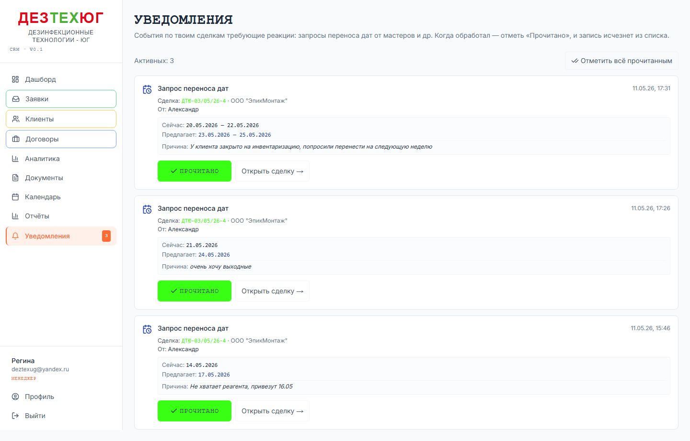

Inbox — твой центр оперативных событий. Здесь собираются вещи которые требуют твоей реакции **сейчас**, помимо обычной работы со сделками.

### 11.1. Что попадает в Inbox

| Событие | Кто инициатор | Как реагировать |
|---|---|---|
| **Запрос переноса дат** | Мастер через карточку сделки | Перенести даты в календаре или связаться с мастером для согласования альтернативы |

В будущем сюда добавятся: эскалации лидов, жалобы клиентов, отказы от КП и др.

### 11.2. Как это работает

- В сайдбаре пункт **«Уведомления»** с **оранжевым бейджем** = количество необработанных событий
- Кликаешь → попадаешь на страницу Inbox с карточками
- Каждая карточка содержит: тип события, время, ссылку на сделку, кто инициировал, детали (что → на что меняется)
- Жмёшь **«Прочитано»** на карточке → она исчезает, бейдж уменьшается на 1
- Кнопка **«Отметить всё прочитанным»** наверху — обнулить весь список разом (когда уверен что всё рассмотрел)

### 11.3. Дублирование с Telegram/Email

Когда мастер запрашивает перенос — менеджер получает уведомление через **3 канала**:
1. **Telegram** (если у менеджера привязан TG в `/profile`)
2. **Email** (если TG не привязан — fallback на email учётки)
3. **Inbox** — всегда, независимо от TG/email

То есть если ты пропустишь TG-сообщение или email уйдёт в спам — Inbox остаётся надёжным местом увидеть запрос. **Проверяй бейдж раз в день минимум.**

### 11.4. Чужие сделки

По умолчанию Inbox показывает только события по сделкам где ты — назначенный менеджер. **Сделки без менеджера** также видны (чтобы кто-то их обработал). Admin видит **все** события.

## 12. Сценарии

### Сценарий 1: Полный цикл от лида до акта

**Стартовая ситуация:** клиент Иван оставил заявку на сайте с просьбой обработать склад от тараканов.

1. **Получение лида:** утром заходишь в CRM → дашборд показывает «Новые заявки: 1»
2. **Просмотр:** клик → `/manager/leads?status=new` → видишь заявку Ивана с телефоном и адресом склада
3. **Звонок:** уточнил детали, договорились на выезд для оценки. Открой карточку лида → перенеси статус в **«Связались»** (или drag в канбане)
4. **Квалификация → КП:** после оценки нужно отправить КП. Удобнее через канбан:
   - `/manager/leads/board` → drag карточки лида в колонку **«КП отправлено»**
   - Откроется **ProposalDialog**:
     - Тип клиента: ИП (`ИП Иванов И.И.`)
     - Email: ivan@example.com
     - Добавь прайс-позицию: объект «Склад на Ленина 15», услуга «Дезинсекция», 200 м², цена 15000₽
     - Срок: 14 дней
   - Жми «Создать»
   - CRM атомарно: создаст клиента-черновик, draft-сделку, прайс, сгенерит DOCX КП, отправит email Ивану
5. **Дополнить реквизиты клиента:** перейди в `/manager/clients` → найди созданного «ИП Иванов И.И.» → дополни ИНН, ОГРНИП, юр.адрес, КПП (если нужно)
6. **Договор подписан:** через неделю Иван подтвердил. Открой сделку → таб «Документы» → жми «Сгенерировать» → «Договор» → скачай DOCX → распечатай → подпиши со стороны ИП → отдай Ивану. Когда Иван подписал свой экземпляр — отсканируй и загрузи как `signedScanS3Key` (через спец-кнопку в карточке документа). Перенеси сделку в **«Подписан»**
7. **Выезд мастера:** в Реквизитах сделки выставь даты выезда + назначь мастера → сделка отображается в `/manager/calendar` и у мастера в `/master/calendar`
8. **Работы реализованы:** мастер выехал, выполнил, написал отчёт в work_log, нажал «Завершить выезд» → сделка автоматически в `completed`
9. **Акт работ:** на сделке → таб «Документы» → «Сгенерировать» → «Акт выполненных работ» → распечатай → отдай клиенту → получи подпись → загрузи скан
10. **Закрыть лид:** перенеси лид (если ещё открыт) в **«Реализована»** в канбане воронки

### Сценарий 2: Зависший лид → как разобраться

Утром получил Telegram-уведомление: «⚠️ Зависших лидов: 3». Среди них:

> 1. Магнит-Юг (+7 988 ...) — 5 дней в стадии «КП отправлено»

Действия:
1. Открой `/manager/leads/board` → найди карточку «Магнит-Юг» с **красной рамкой** (stale)
2. Открой карточку → посмотри последний контакт в History
3. Звони / пиши клиенту — узнай решение
4. Возможные исходы:
   - «Оплачиваем, готовьте договор» → статус `contract_signed` → создавай Договор
   - «Дороговато, давайте подумаем ещё неделю» → ничего не делай, лид останется зависшим до решения
   - «Выбрали другого подрядчика» → статус `lost` с причиной `chose_competitor`

### Сценарий 3: Запрос на удаление документа который создал по ошибке

Сгенерировал КП на 50000₽ для клиента А, но потом понял что цена должна быть другая, и вообще КП должно быть для клиента Б.

1. Открой сделку → таб «Документы» → найди КП-2026-XXX → 🗑 (Запросить удаление)
2. В modal напиши причину: «Создан по ошибке — не тот клиент. Перезапросил для другого договора.»
3. Жми «Запросить удаление». Toast «Запрос отправлен — админ получит его в /admin/deletions»
4. На карточке документа появится badge «Запрошено удаление». Кнопка «Отменить» — если передумал
5. Жди пока Саня одобрит. Когда одобрит — документ исчезнет из списка
6. Если Саня отклонит (например предложит «переведи в архив вместо удаления») — увидишь badge с его заметкой. Реши: отозвать запрос или попросить ещё раз с другой причиной

### Сценарий 4: Перенос даты выезда по запросу мастера

Получил Telegram-уведомление: «Александр (мастер) просит перенести выезд по сделке ДГ-2026-005» — старая дата 14.05, новая 17.05, причина «не хватает реагента, привезут 16.05».

**Альтернатива:** если TG не настроен — увидишь оранжевый бейдж «Уведомления 1» в сайдбаре.

1. Открой ссылку из TG-уведомления → карточка сделки. ИЛИ → `/manager/inbox` → карточка запроса
2. На карточке запроса видишь: текущие даты, предлагаемые даты, причина
3. Согласовано с клиентом? Если да:
   - В карточке Inbox жми **«Открыть сделку →»** → попадаешь в Реквизиты
   - Поменяй даты → «Сохранить»
   - Возвращайся в `/manager/inbox` → жми **«Прочитано»** на карточке запроса → исчезает
4. Если не согласовано — позвони Александру, обсудите альтернативу. После решения — перенеси даты + жми «Прочитано».
5. Если запросов накопилось много и ты их все рассмотрел — кнопка **«Отметить всё прочитанным»** наверху страницы.

### Сценарий 5: Подготовить отчёт по выручке для собственника

Собственник просит «сколько мы заработали в апреле».

1. `/manager/reports?period=30` (или 90 если нужно за квартал)
2. KPI «Доход за период» — общая цифра
3. Секция «1. Доход по месяцам» — детализация
4. Жми **CSV** в шапке секции → получишь файл `revenue-by-month_30d.csv`
5. Откроешь в Excel → форматируй как нужно → отправь собственнику

Если хочешь больше деталей:
- Секция 5 «Топ услуг» — разбивка по чему именно заработали (дезинсекция / дератизация / etc)
- Секция 4 «Активность менеджеров» — кто из менеджеров сколько закрыл
- Секция 2 «Сделки по мастерам» — кто из мастеров принёс выручку

### Сценарий 6: Отвязать Telegram перед отпуском

Уезжаешь в отпуск на 2 недели, не хочешь чтобы зависали уведомления.

1. `/profile` → секция «Telegram-уведомления» → «Отвязать»
2. Confirm → готово
3. Уведомления уйдут на email (если у тебя есть email в учётке) ИЛИ просто не будут идти если email не настроен
4. После отпуска — снова «Привязать Telegram»
