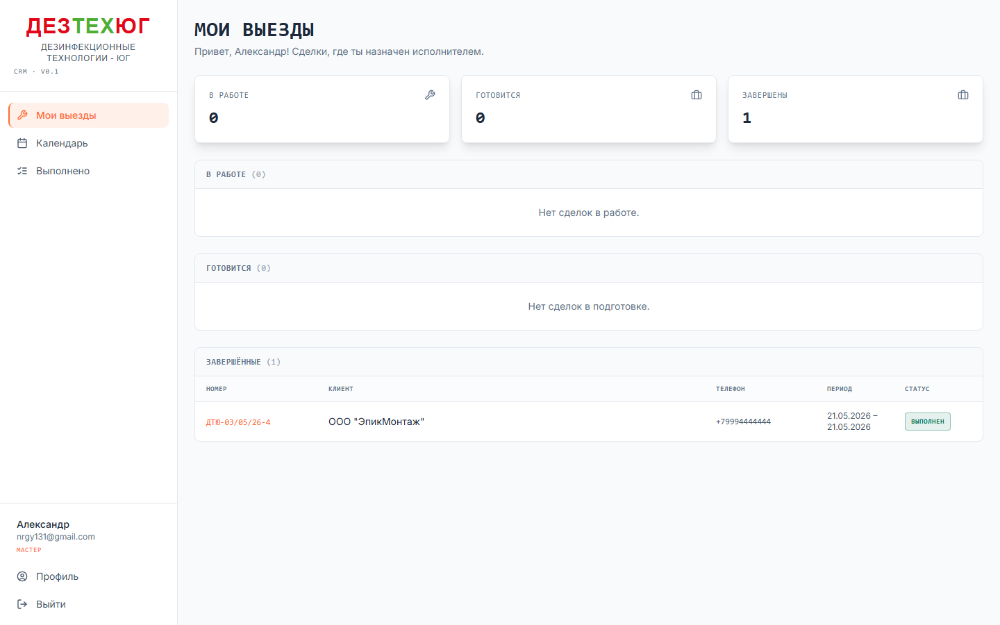
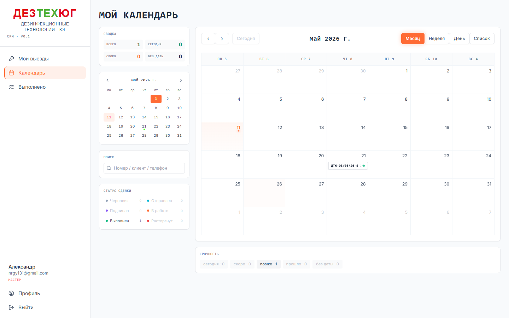
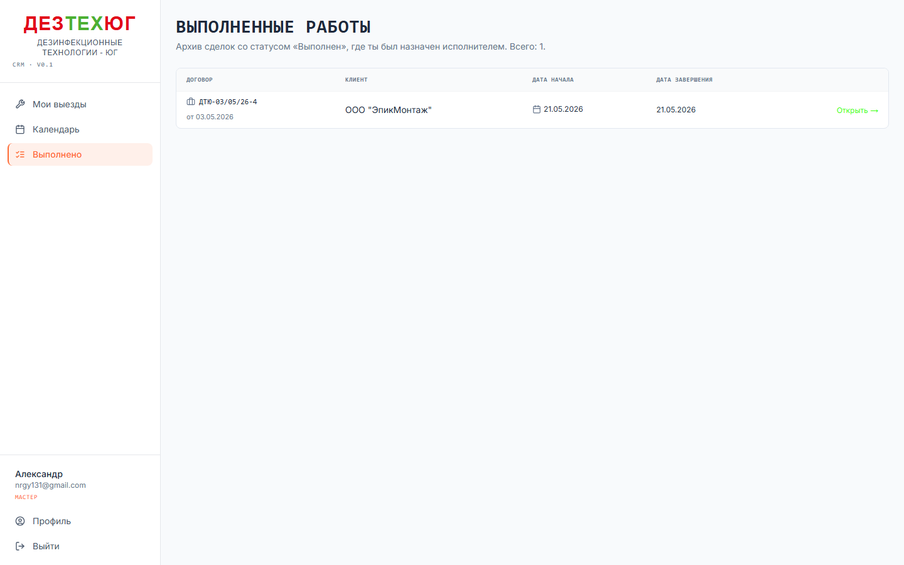
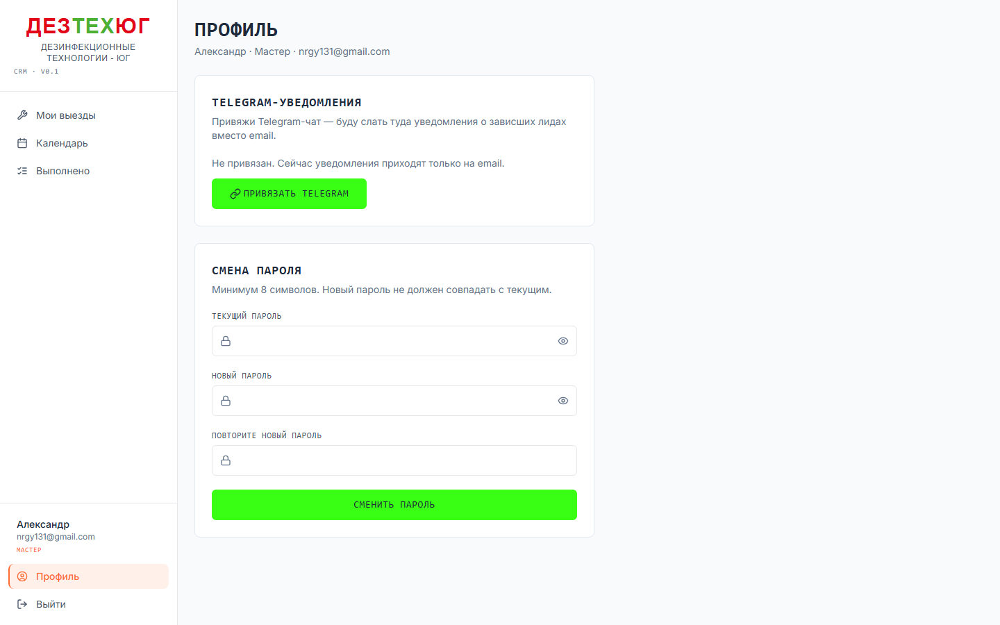

# Мастер — методичка

> Эта методичка — для роли **Мастер** (`role=master`).
> Перед чтением — ознакомься с общей [00-general.md](./00-general.md).

Мастер — это **Александр** (nrgy131@gmail.com). Главная задача: выезжать на объекты по своим сделкам, выполнять работы, фиксировать что сделано в журнале.

## Зона видимости мастера

Мастер видит **только** свои назначенные сделки и **не видит**:
- Цены и суммы (закрыты в SQL-запросе)
- Реквизиты клиента (ИНН, ОГРН, банк) — только название и контактный телефон
- Других менеджеров и мастеров (только себя)
- Любые админ-разделы

## Содержание

1. [Мои выезды](#1-мои-выезды-master)
2. [Календарь](#2-календарь-mastercalendar)
3. [Карточка сделки](#3-карточка-сделки-masterdealsid)
4. [Запрос переноса дат](#4-запрос-переноса-дат)
5. [Журнал работ](#5-журнал-работ)
6. [Завершение выезда](#6-завершение-выезда)
7. [Выполнено (архив)](#7-выполнено-mastercompleted)
8. [Профиль](#8-профиль-profile)
9. [Сценарии](#9-сценарии)

---

## 1. Мои выезды (`/master`)

Главный экран мастера. Список **активных** сделок (статусы `signed`, `active`) с группировкой по статусу.

В каждой строке:
- Номер договора
- Краткое название клиента (без полных реквизитов)
- Период выезда
- Адреса объектов (с link на Я.Карты)

Клик по сделке → карточка сделки (см. раздел 3).

## 2. Календарь (`/master/calendar`)

FullCalendar с твоими выездами. **Read-only** — drag-n-drop у мастера отключён.

### Виды и цвета

См. общую методичку, раздел 6.4. Цвета такие же:
- 🟠 сегодня
- 🟢 скоро (≤ 7 дней)
- ⚪ в будущем
- 🔴 просрочено

### Tooltip

Hover на событии — справа появится подсказка с номером, клиентом, телефоном, периодом.

### Что НЕ можешь

- Перетаскивать события (drag заблокирован)
- Менять даты напрямую

### Что МОЖЕШЬ

- Кликнуть событие → откроется карточка сделки
- Из карточки сделки — **запросить перенос** (см. раздел 4)

## 3. Карточка сделки (`/master/deals/[id]`)

Открывается кликом из «Мои выезды» или из календаря.

**Структура страницы:**

### Шапка
- Номер договора + дата
- Название клиента (без реквизитов)
- Текущий период выезда
- Бейдж статуса
- Кнопка **«Попросить перенести даты»** (см. раздел 4)

### Клиент
- Краткое название
- Телефон (clickable `tel:` — звонит при клике на телефоне)

### Объекты
По каждому объекту:
- Название
- Адрес (link на Яндекс.Карты — открывается в новой вкладке)
- Площадь (м²)
- Контактное лицо на месте + телефон контакта

### План работ
Таблица: объект → услуга → м² → способ → периодичность.

**Без цен.** Это чисто рабочий список — что нужно сделать.

### Журнал работ
Список того что уже сделано (см. раздел 5).

### Форма «Записать что сделано»
Внизу страницы (см. раздел 5).

### Кнопка «Завершить выезд»
Если статус сделки `active` — внизу есть кнопка-завершалка (см. раздел 6).

## 4. Запрос переноса дат

Если выезд назначен на день когда ты не можешь — не пиши даты в чат, отправь формальный запрос через CRM.

### Как отправить

1. Открой карточку сделки
2. Справа сверху — кнопка **«Попросить перенести даты»**
3. Откроется modal:
   - Текущие даты (read-only, для справки)
   - **Новая дата начала** — выбери в date-picker (mandatory)
   - **Новая дата окончания** — опционально (если выезд один день — можно пропустить)
   - **Причина** — мин. 5 символов. Объясни. Примеры:
     - «не хватает реагента, привезут 16.05»
     - «у клиента закрыто, попросили перенести»
     - «пересекается с выездом по ДГ-2026-007»
4. Жми **«Отправить»**
5. Toast «Запрос отправлен менеджеру»

### Что произойдёт

Менеджер получит уведомление по **трём каналам** (надёжность — твой запрос точно увидят):
1. **Telegram** — если у менеджера привязан TG
2. **Email** — если TG не привязан, прилетит на email менеджера
3. **Inbox в CRM** (`/manager/inbox`) — всегда, плюс оранжевый бейдж в сайдбаре менеджера

Менеджер примет решение: согласует с клиентом и перенесёт даты, или позвонит тебе обсудить.

### Когда придёт ответ

Менеджер сам поменяет даты в CRM. Ты увидишь обновлённые даты:
- В **«Мои выезды»**
- В **«Календарь»**
- В шапке карточки сделки

Никакого формального «принято» в ответ не будет — просто обнови страницу через час и проверь.

## 5. Журнал работ

Журнал = список того что выполнено по этой сделке. Каждая запись:
- **Когда** (дата + время)
- **Кто делал** (это ты)
- **Что сделано** (описание)
- **Площадь м²** (опц.)
- **Заметки** (опц., например «обнаружили гнездо в углу С-5»)

### Записать новую работу

В нижней части страницы — форма **«Записать что сделано»**:

1. **Дата выполнения** (когда выезжал) — date+time picker
2. **Описание** — обязательное, мин. 2 символа. Конкретно опиши что сделал. Примеры:
   - «Обработал склад зоны А-Г, расставил приманки по периметру»
   - «Замена приманок в установленных контейнерах + контрольная зачистка»
   - «Туман в зоне готовой продукции, ожидание 4 часа, проветривание»
3. **Площадь м²** (опц.) — если обработал не весь объект
4. **Заметки** (опц.) — что-то особое: обнаружения, проблемы с доступом, то что просил клиент учесть в следующий раз
5. Жми «Сохранить»

Запись попадает в журнал, видна и тебе, и менеджеру.

### Зачем это нужно

- **Для тебя:** план/факт что отработал
- **Для менеджера:** контроль и подготовка акта работ
- **Для клиента:** при подписании акта менеджер ссылается на твой журнал
- **Для отчётности:** в `/manager/reports` есть отчёт «Нагрузка мастеров» который считает количество выездов и общую площадь — берётся из этого журнала

## 6. Завершение выезда

Когда все работы по сделке закончены и больше выездов не планируется — нажимаешь **«Завершить выезд»** на карточке сделки.

Что происходит:
- Статус сделки меняется с `active` (или другого) на **`completed`**
- Сделка пропадает из «Мои выезды»
- Появляется в **«Выполнено»** (`/master/completed`)
- Менеджер видит обновление и готовит акт выполненных работ

**ВАЖНО:** не нажимай если ещё планируются выезды (например периодическое обслуживание). Завершение = «всё, больше не вернусь».

## 7. Выполнено (`/master/completed`)

Архив сделок которые ты завершил. Полезно если нужно посмотреть что делал на конкретном объекте полгода назад.

Колонки и фильтры аналогичны «Мои выезды», но статус всегда `completed`.

## 8. Профиль (`/profile`)

Стандартный профиль:
- **Привязка Telegram** — рекомендуется привязать! Тогда уведомления о новых назначениях / переносах будут приходить в TG, а не теряться в email
- **Смена пароля** — при первом входе обязательна

См. общую методичку, раздел 5 для деталей.

## 9. Сценарии

### Сценарий 1: Подготовка к выезду

Утром открыл CRM, видишь в «Мои выезды» сделку **ДГ-2026-005 — Магнит-Юг, выезд 14.05**.

1. Клик на сделку → карточка
2. Прочти секцию «Объекты»:
   - Адрес → клик → откроется Яндекс.Карты, посмотришь маршрут
   - Контактное лицо → телефон → можно позвонить заранее, уточнить как пройти
3. Прочти «План работ» — что именно делать (например «Дератизация, 800 м², зимний период, способ — приманочные станции»)
4. Проверь что у тебя в наличии:
   - Препараты под этот тип услуги
   - Контейнеры для приманок
   - Защитное снаряжение
5. Едь.

### Сценарий 2: Не получается выехать в назначенную дату

Назначен на 14.05, но в этот день у тебя приём в больнице.

**Не делай так:** не пиши Регине в WhatsApp «не смогу 14, давай 16». Это потеряется.

**Сделай так:**
1. Открой сделку → «Попросить перенести даты»
2. Новая дата = 16.05
3. Причина = «врачебный приём 14.05, могу 16-го»
4. Отправь
5. Регина получит уведомление в TG (если привязан) → согласует с клиентом → перенесёт даты в CRM
6. Через час обнови страницу → дата обновится

### Сценарий 3: Зафиксировать что сделал

Закончил выезд на склад «Магнит-Юг» в 16:30. Обработал 800 м², расставил 12 приманочных станций.

1. На месте (или вечером) открой CRM на телефоне → **`/master`** → найди сделку
2. Прокрути вниз до формы «Записать что сделано»
3. Дата = 14.05.2026 14:00 (когда начал)
4. Описание = «Дератизация склада. Расставил 12 приманочных станций по периметру здания, обработал зоны хранения. Пометил станции номерами 1-12 на схеме (отдал клиенту копию). Следующий контроль через 2 недели согласно плану.»
5. Площадь = 800
6. Заметки = «Обнаружены свежие следы в зоне погрузки (С-5). Рекомендую дополнительный визит через неделю если активность сохранится.»
7. Сохрани

### Сценарий 4: Завершение многоразовой сделки

По ДГ-2026-005 был годовой контракт «12 ежемесячных дезобработок». Ты сделал все 12 выездов. После последнего:

1. Запиши последний выезд в журнал (как в сценарии 3)
2. Внизу карточки → **«Завершить выезд»**
3. Confirm
4. Сделка переходит в `completed` → пропадает из «Мои выезды» → появляется в «Выполнено»
5. Регина увидит обновление, подготовит финальный акт работ за весь период

### Сценарий 5: Где найти сделку которую закрыл год назад

Клиент звонит: «Помнишь, ты у нас был в марте 2025? Что вы делали в зоне F?»

1. `/master/completed` → ищи по дате (или по названию клиента в фильтре)
2. Открой карточку → таб **«Журнал работ»** → найди записи за март 2025
3. Прочитай свои описания и заметки
4. Прочитай «План работ» — что было запланировано
5. Расскажи клиенту

### Сценарий 6: Привязать Telegram

Чтобы получать уведомления о новых назначениях и подтверждениях переноса:

1. Открой Telegram на телефоне
2. На компе зайди в CRM → `/profile`
3. «Привязать Telegram» → откроется ссылка типа `https://t.me/DTUnvrsk_bot?start=ABC...`
4. На телефоне открой эту ссылку (можно скопировать-вставить в адресную строку Telegram, или сразу из CRM jump'нуть)
5. В диалоге с ботом → **«Запустить» / START**
6. Бот ответит «✅ Готово, Александр! Теперь буду слать тебе уведомления сюда.»
7. Готово. С этого момента уведомления о новых сделках и важных событиях приходят в TG.
